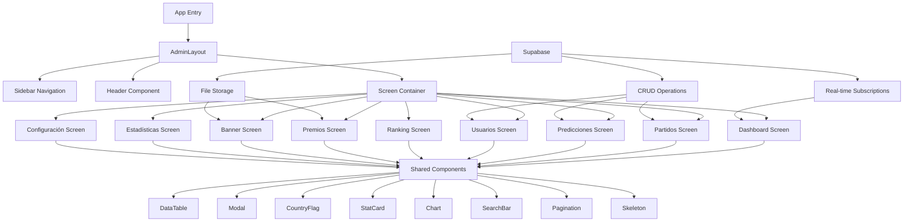
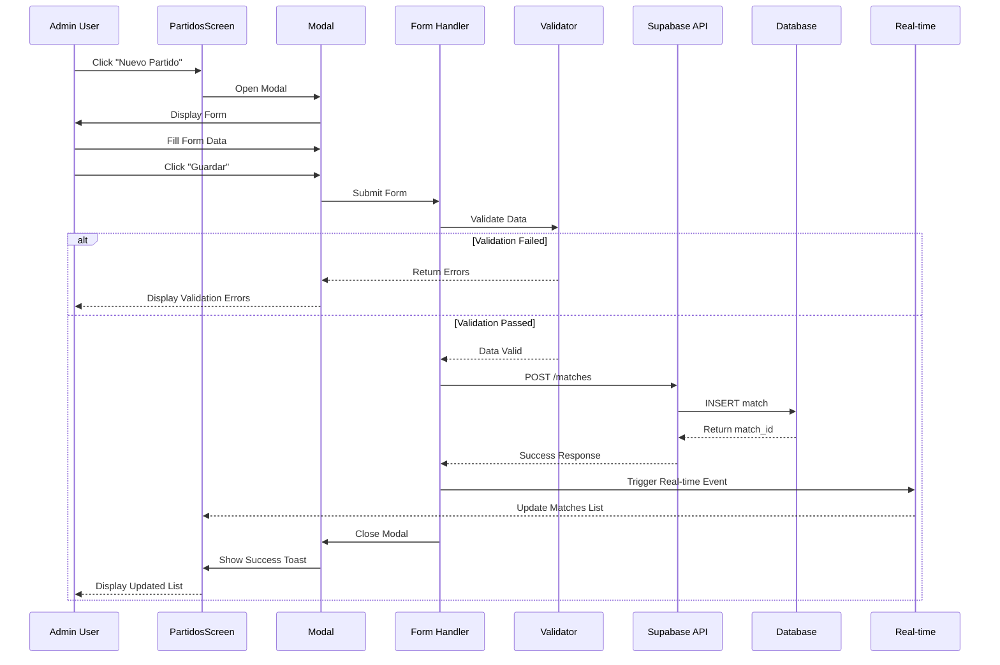

# Design Document: Admin Frontend Redesign Mundial 2026

## Overview

Rediseño completo del panel administrativo del Prode Mundialista 2026 con enfoque en diseño moderno tipo SaaS (Linear, Stripe, Notion, Vercel). El sistema incluye 9 pantallas principales con glassmorphism, dark mode nativo, y arquitectura mobile-first responsive. La solución implementa componentes reutilizables, integración con Supabase, y experiencia de usuario premium con animaciones fluidas y tablas interactivas con funcionalidades avanzadas (búsqueda, filtros, paginación, skeletons).

**Tech Stack:**
- React Native + Expo (SDK 56)
- TypeScript (strict mode)
- React Router (expo-router)
- Supabase (backend y real-time)
- React Query (@tanstack/react-query)
- Zustand (state management)
- Zod (validation)
- Expo Linear Gradient (glassmorphism)
- React Hook Form (forms)

**Design System:**
- Palette: #CC2627 (primary), dark/light themes
- Typography: Poppins (400, 500, 600, 700)
- Spacing: 8px scale (4, 8, 12, 16, 20, 24, 32, 40, 48)
- Border Radius: 6, 12, 16, 20, 24, 32, 9999
- Shadows: sm, md, lg, xl, glow, float
- Glassmorphism: rgba blur effects

## Architecture

## Sequence Diagrams

### User Flow: CRUD Operation (Create Match)

### User Flow: Real-time Update

