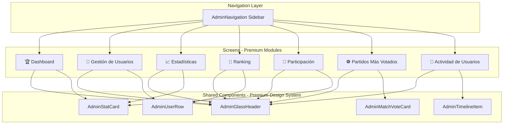

# Design Document: Admin Panel Premium Mundial 2026

## Overview

Transform the admin panel from generic corporate UI to the premium World Cup 2026 visual identity used throughout the user-facing app. This design replicates the exact visual system from HeroStatsBanner, MatchCard, PremiumRankingCard, and GlassHeader components - including dark red gradients, celeste accents, flag emojis as primary visual elements, glass morphism, premium typography, and animated elements. The admin panel will feature 7 core modules with reusable components that match the user app's premium aesthetic.

## Architecture



## Main Algorithm/Workflow

```mermaid
sequenceDiagram
    participant Admin as Admin User
    participant Nav as AdminNavigation
    participant Screen as Admin Screen
    participant Component as Premium Component
    participant Theme as Theme System
    
    Admin->>Nav: Navigate to module
    Nav->>Screen: Render selected screen
    Screen->>Theme: Request theme colors
    Theme-->>Screen: Return Mundial 2026 colors
    Screen->>Component: Render premium components
    Component->>Theme: Apply celeste/red styling
    Theme-->>Component: Glass morphism + gradients
    Component-->>Screen: Premium UI rendered
    Screen-->>Admin: Display Mundial 2026 design


## Core Interfaces/Types

```typescript
// Premium Color System - EXACT from user app
interface MundialColorSystem {
  primary: {
    red: '#CC2627';
    celeste: '#6EC6FF';
    celesteDark: '#3DA5F5';
    celesteBg: '#EBF5FF';
  };
  semantic: {
    success: '#4CAF50';
    error: '#F44336';
    warning: '#FF9800';
    info: '#2196F3';
    muted: '#9E9E9E';
  };
  gradients: {
    heroGradient: ['#1a0000', '#3a0000', '#CC2627'];
    heroOverlay: ['rgba(0,0,0,0)', 'rgba(0,0,0,0.75)'];
    glassDark: 'rgba(18,18,18,0.94)';
    glassLight: 'rgba(255,255,255,0.94)';
  };
  glass: {
    dark: 'rgba(0,0,0,0.35)';
    light: 'rgba(255,255,255,0.15)';
    border: 'rgba(255,255,255,0.3)';
  };
}

// Premium Typography - EXACT from HeroStatsBanner/PremiumRankingCard
interface PremiumTypography {
  hero: {
    fontSize: 30;
    fontWeight: '800';
    letterSpacing: -0.5;
  };
  title: {
    fontSize: 18;
    fontWeight: '700';
    letterSpacing: 0;
  };
  body: {
    fontSize: 14;
    fontWeight: '600';
  };
  small: {
    fontSize: 11;
    fontWeight: '500';
  };
  badge: {
    fontSize: 11;
    fontWeight: '700';
    letterSpacing: 0.5;
  };
}

// Admin Glass Header Component (based on GlassHeader)
interface AdminGlassHeaderProps {
  adminName?: string;
  adminRole: 'super-admin' | 'admin' | 'moderator';
  onLogout: () => void;
  hasUnreadNotifications?: boolean;
}

// Admin Stat Card (based on HeroStatsBanner style)
interface AdminStatCardProps {
  icon: string; // emoji or MaterialCommunityIcons name
  value: number | string;
  label: string;
  trend?: {
    value: number;
    direction: 'up' | 'down' | 'neutral';
  };
  variant: 'gradient' | 'glass' | 'celeste' | 'red';
}

// Admin User Row (based on PremiumRankingCard)
interface AdminUserRowProps {
  user: {
    id: string;
    name: string;
    company: string;
    points: number;
    exactPredictions: number;
    simplePredictions: number;
    position: number;
    isActive: boolean;
    variation?: number;
    variationDirection?: 'up' | 'down' | 'neutral';
  };
  onPress?: () => void;
  showActions?: boolean;
}

// Admin Match Vote Card (EXACT copy of MatchCard + vote overlay)
interface AdminMatchVoteCardProps {
  homeTeam: string;
  awayTeam: string;
  homeCode: string;
  awayCode: string;
  date: string;
  time: string;
  group?: string;
  totalVotes: number;
  homeVotes: number;
  awayVotes: number;
  drawVotes: number;
  onPress?: () => void;
}

// Admin Timeline Item (glass card design)
interface AdminTimelineItemProps {
  user: {
    name: string;
    initials: string;
  };
  action: string;
  description: string;
  timestamp: Date;
  type: 'prediction' | 'login' | 'points' | 'badge' | 'admin-action';
}

// Admin Navigation Module
interface AdminModule {
  id: string;
  icon: string; // emoji
  label: string;
  route: string;
  badge?: number; // unread count
}


## Key Functions with Formal Specifications

### Function 1: renderAdminGlassHeader()

```typescript
function renderAdminGlassHeader(props: AdminGlassHeaderProps): JSX.Element
```

**Preconditions:**
- `props.adminRole` is one of: 'super-admin', 'admin', 'moderator'
- `props.onLogout` is a valid function reference
- Theme context is available (isDark property)

**Postconditions:**
- Returns glass morphism header with rgba(18,18,18,0.94) dark or rgba(255,255,255,0.94) light
- Admin avatar displays shield icon (MaterialCommunityIcons "shield-crown")
- "Mundial 2026 🏆" subtitle is always displayed
- Logout button has rgba(244,67,54,0.12) background
- Safe area insets are applied to top padding
- Component matches exact GlassHeader.tsx styling

**Loop Invariants:** N/A (no loops)

---

### Function 2: renderAdminStatCard()

```typescript
function renderAdminStatCard(props: AdminStatCardProps): JSX.Element
```

**Preconditions:**
- `props.variant` is one of: 'gradient', 'glass', 'celeste', 'red'
- `props.value` is defined (number or string)
- `props.label` is non-empty string
- If `props.trend` exists, trend.direction is 'up' | 'down' | 'neutral'

**Postconditions:**
- If variant='gradient': applies LinearGradient with ['#1a0000', '#3a0000', '#CC2627']
- If variant='celeste': uses #6EC6FF border with rgba(110,198,255,0.12) background
- Value displayed with fontSize 30, fontWeight 800, letterSpacing -0.5 (hero typography)
- Icon wrapped in glass chip with rgba(0,0,0,0.35) background (if gradient variant)
- Trend arrow uses green (#4CAF50) for 'up', red (#F44336) for 'down'
- Border radius is 20px for cards, 14px for badges
- Matches exact HeroStatsBanner.tsx styling

**Loop Invariants:** N/A (no loops)

---

### Function 3: renderAdminUserRow()

```typescript
function renderAdminUserRow(props: AdminUserRowProps): JSX.Element
```

**Preconditions:**
- `props.user` is non-null with all required fields
- `props.user.position` is positive integer
- `props.user.isActive` is boolean
- If variation exists, variationDirection must be specified

**Postconditions:**
- Avatar circle displays first 2 letters of name in uppercase
- Active users show celeste badge background (#6EC6FF)
- Position 1-3 display medal emojis (🥇🥈🥉) instead of numbers
- Variation displayed with arrow (↑↓–) and color (green/red/muted)
- BorderRadius is radius.xl (20px)
- Celeste highlight for active users: rgba(61,165,245,0.12) dark, rgba(110,198,255,0.10) light
- Shadow: shadowColor #6EC6FF, shadowOpacity 0.30, shadowRadius 10 for highlighted
- Matches exact PremiumRankingCard.tsx structure

**Loop Invariants:** N/A (no loops)

---

### Function 4: renderAdminMatchVoteCard()

```typescript
function renderAdminMatchVoteCard(props: AdminMatchVoteCardProps): JSX.Element
```

**Preconditions:**
- `props.homeCode` and `props.awayCode` are valid ISO country codes
- `props.totalVotes` is non-negative integer
- Sum of homeVotes + awayVotes + drawVotes equals totalVotes
- Date and time strings are valid

**Postconditions:**
- Flag circles use getNationalColor() for background (national team colors)
- Flag emojis displayed at fontSize 30 (PRIMARY visual element)
- Celeste border: rgba(110,198,255,0.12) dark, rgba(110,198,255,0.2) light
- BorderRadius is 20px
- VS text has letterSpacing 1, fontWeight 800
- Vote count overlay with glass background rgba(0,0,0,0.35)
- Shadow: shadowColor #6EC6FF, shadowOffset {width:0, height:2}, shadowOpacity 0.08
- EXACT copy of MatchCard.tsx with vote overlay added

**Loop Invariants:** N/A (no loops)

---

### Function 5: renderAdminTimelineItem()

```typescript
function renderAdminTimelineItem(props: AdminTimelineItemProps): JSX.Element
```

**Preconditions:**
- `props.user.initials` is 1-2 uppercase letters
- `props.timestamp` is valid Date object
- `props.type` is one of: 'prediction', 'login', 'points', 'badge', 'admin-action'

**Postconditions:**
- Glass card background with theme.colors.surface
- Avatar circle with celeste background (#3DA5F5) for user-initiated actions
- Type badge with appropriate color (celeste for predictions, green for points, etc.)
- Timestamp formatted as relative time ("hace 5 min", "hace 2 horas")
- BorderRadius is 20px
- Padding is 16px (spacing.lg)
- Action description displayed with fontWeight 600

**Loop Invariants:** N/A (no loops)


## Algorithmic Pseudocode

### Main Rendering Algorithm for Admin Screens

```pascal
ALGORITHM renderAdminScreen(screenType, data)
INPUT: screenType (string: 'dashboard' | 'users' | 'statistics' | etc.), data (object)
OUTPUT: rendered JSX with premium Mundial 2026 styling

BEGIN
  ASSERT screenType is valid admin module type
  ASSERT theme context is available
  
  // Step 1: Render glass header (consistent across all screens)
  header ← renderAdminGlassHeader({
    adminRole: currentUser.role,
    onLogout: handleLogout,
    hasUnreadNotifications: notificationStore.unreadCount > 0
  })
  
  // Step 2: Determine content based on screen type
  MATCH screenType WITH
    CASE 'dashboard':
      content ← renderDashboardContent(data)
    CASE 'users':
      content ← renderUsersContent(data)
    CASE 'statistics':
      content ← renderStatisticsContent(data)
    CASE 'rankings':
      content ← renderRankingsContent(data)
    CASE 'participation':
      content ← renderParticipationContent(data)
    CASE 'voted-matches':
      content ← renderVotedMatchesContent(data)
    CASE 'user-activity':
      content ← renderUserActivityContent(data)
    OTHERWISE:
      THROW Error("Invalid screen type")
  END MATCH
  
  // Step 3: Apply premium scroll container
  scrollView ← createPremiumScrollView({
    backgroundColor: theme.colors.background,
    showsVerticalScrollIndicator: false,
    contentContainerStyle: {
      padding: spacing.lg
    }
  })
  
  // Step 4: Compose final screen
  screen ← compose(header, scrollView(content))
  
  ASSERT screen has Mundial 2026 visual identity applied
  
  RETURN screen
END
```

**Preconditions:**
- screenType is a valid admin module identifier
- data object matches expected structure for screenType
- Theme provider is initialized
- User is authenticated as admin

**Postconditions:**
- Screen rendered with glass header at top
- Content uses premium components with Mundial 2026 styling
- Background color matches theme
- Scroll view configured for optimal UX

**Loop Invariants:**
- Theme consistency maintained throughout render cycle

---

### Dashboard Content Rendering Algorithm

```pascal
ALGORITHM renderDashboardContent(data)
INPUT: data containing stats, trends, recent activity
OUTPUT: premium dashboard layout with hero stats

BEGIN
  // Step 1: Create hero stats banner (gradient background)
  heroSection ← createLinearGradient({
    colors: ['#1a0000', '#3a0000', '#CC2627'],
    borderRadius: 20,
    padding: spacing.lg
  })
  
  // Add stats to hero
  heroSection.addChild(
    Text("🏆 MUNDIAL 2026", style: {
      fontSize: 11, fontWeight: 700, letterSpacing: 0.8,
      color: 'rgba(255,255,255,0.75)'
    })
  )
  
  heroSection.addChild(
    Text(data.totalUsers + " USUARIOS", style: {
      fontSize: 30, fontWeight: 800, letterSpacing: -0.5,
      color: '#fff'
    })
  )
  
  // Step 2: Create stats grid (2 columns)
  statsGrid ← createFlexGrid({
    columns: 2,
    gap: spacing.md
  })
  
  FOR each stat IN data.stats DO
    card ← renderAdminStatCard({
      icon: stat.icon,
      value: stat.value,
      label: stat.label,
      variant: stat.highlighted ? 'celeste' : 'glass',
      trend: stat.trend
    })
    statsGrid.addChild(card)
  END FOR
  
  // Step 3: Create recent activity timeline
  timeline ← createContainer({
    gap: spacing.sm,
    marginTop: spacing.xl
  })
  
  timeline.addChild(
    Text("Actividad Reciente", style: {
      fontSize: 18, fontWeight: 700
    })
  )
  
  FOR each activity IN data.recentActivity.slice(0, 5) DO
    timelineItem ← renderAdminTimelineItem(activity)
    timeline.addChild(timelineItem)
  END FOR
  
  // Step 4: Compose sections
  content ← compose(heroSection, statsGrid, timeline)
  
  RETURN content
END
```

**Preconditions:**
- data.stats is array of stat objects
- data.recentActivity is array of activity objects sorted by timestamp descending
- All numeric values are valid

**Postconditions:**
- Hero section has red gradient background with white text
- Stats displayed in 2-column grid
- Recent activity shows max 5 items
- All typography follows premium specifications

**Loop Invariants:**
- Each stat card maintains visual consistency
- Activity items maintain chronological order

---

### Users Management Rendering Algorithm

```pascal
ALGORITHM renderUsersContent(data)
INPUT: data containing users array, filters, pagination
OUTPUT: user list with premium ranking card styling

BEGIN
  // Step 1: Create search and filter bar
  filterBar ← createGlassContainer({
    flexDirection: 'row',
    gap: spacing.md,
    padding: spacing.md,
    backgroundColor: theme.colors.surface,
    borderRadius: 20,
    borderWidth: 1,
    borderColor: 'rgba(110,198,255,0.12)'
  })
  
  searchInput ← createTextInput({
    placeholder: "Buscar usuario...",
    style: { flex: 1, fontSize: 14, fontWeight: 600 }
  })
  
  filterBar.addChild(searchInput)
  
  // Step 2: Add filter chips
  filters ← ['Todos', 'Activos', 'Inactivos', 'Top 10']
  FOR each filter IN filters DO
    chip ← createPressable({
      onPress: () => handleFilterChange(filter),
      style: {
        paddingHorizontal: 12,
        paddingVertical: 6,
        borderRadius: 20,
        backgroundColor: filter === activeFilter
          ? 'rgba(110,198,255,0.15)'
          : 'rgba(0,0,0,0.05)'
      }
    })
    chip.addChild(
      Text(filter, style: {
        fontSize: 12, fontWeight: 700,
        color: filter === activeFilter ? '#3DA5F5' : theme.colors.text
      })
    )
    filterBar.addChild(chip)
  END FOR
  
  // Step 3: Create user rows (ranking card style)
  userList ← createContainer({
    gap: spacing.sm,
    marginTop: spacing.lg
  })
  
  sortedUsers ← sortByPosition(data.users)
  
  FOR each user IN sortedUsers DO
    ASSERT user.position is valid
    
    userRow ← renderAdminUserRow({
      user: user,
      onPress: () => navigateToUserDetail(user.id),
      showActions: true
    })
    
    userList.addChild(userRow)
  END FOR
  
  // Step 4: Add pagination if needed
  IF data.users.length >= data.pageSize THEN
    pagination ← createPagination({
      currentPage: data.currentPage,
      totalPages: data.totalPages,
      onPageChange: handlePageChange
    })
    userList.addChild(pagination)
  END IF
  
  content ← compose(filterBar, userList)
  
  ASSERT all user rows follow PremiumRankingCard styling
  
  RETURN content
END
```

**Preconditions:**
- data.users is array of user objects
- Each user has position, name, company, points, isActive
- activeFilter is one of the defined filter types
- Pagination data is valid if present

**Postconditions:**
- Search bar has celeste border
- Active filter chip highlighted with celeste background
- Users sorted by position ascending
- Top 3 users show medal emojis
- Active users have celeste highlight
- Pagination displayed only if needed

**Loop Invariants:**
- User rows maintain consistent styling throughout iteration
- Position numbers are sequential

---

### Voted Matches Rendering Algorithm

```pascal
ALGORITHM renderVotedMatchesContent(data)
INPUT: data containing matches with vote counts
OUTPUT: match cards with vote overlay (MatchCard style)

BEGIN
  // Step 1: Create header with total stats
  headerCard ← renderAdminStatCard({
    icon: '⚽',
    value: data.totalVotes,
    label: 'Total de Votos',
    variant: 'gradient'
  })
  
  // Step 2: Sort matches by vote count
  sortedMatches ← sortByVoteCount(data.matches, descending: true)
  
  // Step 3: Create match cards grid
  matchesGrid ← createContainer({
    gap: spacing.md,
    marginTop: spacing.lg
  })
  
  FOR each match IN sortedMatches DO
    ASSERT match.totalVotes === match.homeVotes + match.awayVotes + match.drawVotes
    
    // Calculate vote percentages
    homePercent ← (match.homeVotes / match.totalVotes) * 100
    awayPercent ← (match.awayVotes / match.totalVotes) * 100
    drawPercent ← (match.drawVotes / match.totalVotes) * 100
    
    matchCard ← renderAdminMatchVoteCard({
      homeTeam: match.homeTeam,
      awayTeam: match.awayTeam,
      homeCode: match.homeCode,
      awayCode: match.awayCode,
      date: formatDate(match.date),
      time: formatTime(match.time),
      group: match.group,
      totalVotes: match.totalVotes,
      homeVotes: match.homeVotes,
      awayVotes: match.awayVotes,
      drawVotes: match.drawVotes,
      onPress: () => navigateToMatchDetail(match.id)
    })
    
    // Add vote distribution bar
    voteBar ← createVoteDistributionBar({
      homePercent: homePercent,
      awayPercent: awayPercent,
      drawPercent: drawPercent,
      homeColor: getNationalColor(match.homeCode).primary,
      awayColor: getNationalColor(match.awayCode).primary
    })
    
    matchCard.addChild(voteBar)
    matchesGrid.addChild(matchCard)
  END FOR
  
  content ← compose(headerCard, matchesGrid)
  
  ASSERT all match cards use flag emojis as primary visual
  ASSERT all cards have celeste borders
  
  RETURN content
END
```

**Preconditions:**
- data.matches is array of match objects
- Each match has valid homeCode/awayCode for flag emoji lookup
- Vote counts are non-negative integers
- totalVotes sum matches individual vote counts

**Postconditions:**
- Matches sorted by total votes descending (most voted first)
- Flag circles use national team colors
- Vote distribution bar shows accurate percentages
- Celeste border on all match cards (exact MatchCard styling)
- Flag emojis displayed at fontSize 30

**Loop Invariants:**
- Vote percentages sum to 100% (within rounding)
- National colors correctly applied for each team
- Card styling consistent with MatchCard.tsx

---

### User Activity Timeline Rendering Algorithm

```pascal
ALGORITHM renderUserActivityContent(data)
INPUT: data containing activity log entries
OUTPUT: timeline with glass card items

BEGIN
  // Step 1: Create time filter tabs
  filterTabs ← ['Hoy', 'Esta semana', 'Este mes', 'Todo']
  tabBar ← createTabBar({
    tabs: filterTabs,
    activeTab: data.activeTimeFilter,
    onTabChange: handleTimeFilterChange,
    style: {
      backgroundColor: theme.colors.surface,
      borderRadius: 20,
      padding: spacing.xs
    }
  })
  
  // Step 2: Filter activities by time
  filteredActivities ← filterByTimeRange(
    data.activities,
    data.activeTimeFilter
  )
  
  // Step 3: Group by date
  groupedByDate ← groupActivitiesByDate(filteredActivities)
  
  // Step 4: Render timeline
  timeline ← createContainer({
    gap: spacing.lg,
    marginTop: spacing.lg
  })
  
  FOR each dateGroup IN groupedByDate DO
    // Date header
    dateHeader ← Text(formatDateHeader(dateGroup.date), style: {
      fontSize: 14, fontWeight: 700,
      color: theme.colors.text,
      marginBottom: spacing.sm
    })
    timeline.addChild(dateHeader)
    
    // Activities for this date
    FOR each activity IN dateGroup.activities DO
      ASSERT activity.user.initials is valid
      ASSERT activity.timestamp is Date object
      
      timelineItem ← renderAdminTimelineItem({
        user: {
          name: activity.user.name,
          initials: activity.user.initials
        },
        action: activity.action,
        description: activity.description,
        timestamp: activity.timestamp,
        type: activity.type
      })
      
      timeline.addChild(timelineItem)
    END FOR
  END FOR
  
  // Step 5: Add load more if needed
  IF data.hasMore THEN
    loadMoreButton ← createPressable({
      onPress: handleLoadMore,
      style: {
        alignSelf: 'center',
        paddingHorizontal: spacing.lg,
        paddingVertical: spacing.md,
        borderRadius: 20,
        backgroundColor: 'rgba(110,198,255,0.12)',
        borderWidth: 1,
        borderColor: '#3DA5F5'
      }
    })
    loadMoreButton.addChild(
      Text("Cargar más", style: {
        fontSize: 14, fontWeight: 700, color: '#3DA5F5'
      })
    )
    timeline.addChild(loadMoreButton)
  END IF
  
  content ← compose(tabBar, timeline)
  
  ASSERT all timeline items have glass card backgrounds
  ASSERT activities grouped chronologically
  
  RETURN content
END
```

**Preconditions:**
- data.activities is array sorted by timestamp descending
- Each activity has user, action, timestamp, type
- activeTimeFilter is valid time range identifier
- User initials are 1-2 uppercase characters

**Postconditions:**
- Activities grouped by date with headers
- Each item in glass card format
- Type-specific badge colors applied
- Load more button shown only if hasMore is true
- Chronological order maintained within date groups

**Loop Invariants:**
- Date groups maintain chronological order
- Timeline items within group maintain time sequence
- Glass card styling consistent across all items


## Example Usage

### Example 1: AdminGlassHeader Component (based on GlassHeader.tsx)

```typescript
import React from 'react';
import { View, Text, Pressable, StyleSheet } from 'react-native';
import { MaterialCommunityIcons } from '@expo/vector-icons';
import { useSafeAreaInsets } from 'react-native-safe-area-context';
import { useAppTheme } from '../../../providers/ThemeProvider';
import { spacing, radius, shadows } from '../../../theme/theme';

interface AdminGlassHeaderProps {
  adminName?: string;
  adminRole: 'super-admin' | 'admin' | 'moderator';
  onLogout: () => void;
  hasUnreadNotifications?: boolean;
}

export function AdminGlassHeader({
  adminName = 'Admin',
  adminRole,
  onLogout,
  hasUnreadNotifications = false,
}: AdminGlassHeaderProps) {
  const { theme } = useAppTheme();
  const insets = useSafeAreaInsets();
  
  // EXACT glass morphism from GlassHeader.tsx
  const bgColor = theme.isDark ? 'rgba(18,18,18,0.94)' : 'rgba(255,255,255,0.94)';
  const borderColor = theme.isDark ? 'rgba(255,255,255,0.07)' : 'rgba(0,0,0,0.06)';
  const iconButtonBg = theme.isDark ? 'rgba(255,255,255,0.07)' : 'rgba(0,0,0,0.05)';
  
  return (
    <View
      style={[
        styles.container,
        {
          backgroundColor: bgColor,
          borderBottomColor: borderColor,
          paddingTop: insets.top + 10,
        },
        shadows.sm,
      ]}
    >
      {/* Left: Admin avatar + text */}
      <View style={styles.leftSection}>
        <View style={[styles.adminAvatar, { backgroundColor: theme.colors.primary }]}>
          <MaterialCommunityIcons name="shield-crown" size={22} color="#fff" />
        </View>
        <View>
          <Text style={[styles.greeting, { color: theme.colors.textSecondary }]}>
            Panel Admin 🛡️
          </Text>
          <Text style={[styles.adminName, { color: theme.colors.text }]} numberOfLines={1}>
            {adminName}
          </Text>
          <Text style={[styles.subtitle, { color: theme.colors.primary }]}>
            Mundial 2026 🏆
          </Text>
        </View>
      </View>

      {/* Right: Logout button */}
      <Pressable
        onPress={onLogout}
        style={[styles.logoutButton, { backgroundColor: 'rgba(244,67,54,0.12)' }]}
        accessibilityLabel="Cerrar sesión"
        accessibilityRole="button"
      >
        <MaterialCommunityIcons name="logout" size={18} color={theme.colors.error} />
      </Pressable>
    </View>
  );
}

const styles = StyleSheet.create({
  container: {
    flexDirection: 'row',
    alignItems: 'center',
    justifyContent: 'space-between',
    paddingHorizontal: spacing.lg,
    paddingBottom: spacing.md,
    borderBottomWidth: 1,
  },
  leftSection: {
    flexDirection: 'row',
    alignItems: 'center',
    flex: 1,
    gap: spacing.md,
  },
  adminAvatar: {
    width: 46,
    height: 46,
    borderRadius: 23,
    alignItems: 'center',
    justifyContent: 'center',
  },
  greeting: {
    fontSize: 12,
    fontWeight: '500',
  },
  adminName: {
    fontSize: 16,
    fontWeight: '700',
    marginTop: 1,
  },
  subtitle: {
    fontSize: 12,
    fontWeight: '600',
    marginTop: 2,
  },
  logoutButton: {
    width: 40,
    height: 40,
    borderRadius: radius.md,
    alignItems: 'center',
    justifyContent: 'center',
  },
});
```

---

### Example 2: AdminStatCard Component (based on HeroStatsBanner.tsx)

```typescript
import React from 'react';
import { View, Text, StyleSheet } from 'react-native';
import { LinearGradient } from 'expo-linear-gradient';
import { MaterialCommunityIcons } from '@expo/vector-icons';
import { useAppTheme } from '../../../providers/ThemeProvider';
import { spacing, radius, shadows } from '../../../theme/theme';

interface AdminStatCardProps {
  icon: string;
  value: number | string;
  label: string;
  trend?: {
    value: number;
    direction: 'up' | 'down' | 'neutral';
  };
  variant: 'gradient' | 'glass' | 'celeste' | 'red';
}

export function AdminStatCard({
  icon,
  value,
  label,
  trend,
  variant,
}: AdminStatCardProps) {
  const { theme } = useAppTheme();
  
  // EXACT gradient from HeroStatsBanner
  const gradientColors = ['#1a0000', '#3a0000', '#CC2627'];
  
  // Trend styling (exact from PremiumRankingCard)
  const trendColor =
    trend?.direction === 'up'
      ? '#4CAF50'
      : trend?.direction === 'down'
      ? '#F44336'
      : theme.colors.muted;
  const trendArrow =
    trend?.direction === 'up' ? '↑' : trend?.direction === 'down' ? '↓' : '–';
  
  if (variant === 'gradient') {
    return (
      <View style={styles.wrapper}>
        <LinearGradient
          colors={gradientColors}
          start={{ x: 0, y: 0 }}
          end={{ x: 1, y: 1 }}
          style={[styles.gradientCard, shadows.lg]}
        >
          {/* Icon in glass chip */}
          <View style={styles.glassChip}>
            <Text style={styles.iconEmoji}>{icon}</Text>
          </View>
          
          {/* Value - EXACT typography from HeroStatsBanner */}
          <Text style={styles.heroValue}>{value}</Text>
          
          {/* Label */}
          <Text style={styles.heroLabel}>{label.toUpperCase()}</Text>
          
          {/* Trend (if present) */}
          {trend && (
            <View style={styles.trendBadge}>
              <Text style={[styles.trendText, { color: trendColor }]}>
                {trendArrow} {Math.abs(trend.value)}
              </Text>
            </View>
          )}
        </LinearGradient>
      </View>
    );
  }
  
  // Celeste variant (for highlights)
  if (variant === 'celeste') {
    return (
      <View
        style={[
          styles.celesteCard,
          {
            backgroundColor: theme.isDark
              ? 'rgba(110,198,255,0.12)'
              : 'rgba(110,198,255,0.10)',
            borderColor: '#3DA5F5',
          },
          {
            shadowColor: '#6EC6FF',
            shadowOffset: { width: 0, height: 0 },
            shadowOpacity: 0.30,
            shadowRadius: 10,
            elevation: 6,
          },
        ]}
      >
        <MaterialCommunityIcons name={icon as any} size={28} color="#3DA5F5" />
        <Text style={[styles.value, { color: '#3DA5F5' }]}>{value}</Text>
        <Text style={[styles.label, { color: theme.colors.text }]}>{label}</Text>
        {trend && (
          <Text style={[styles.trendSmall, { color: trendColor }]}>
            {trendArrow}{Math.abs(trend.value)}
          </Text>
        )}
      </View>
    );
  }
  
  // Glass variant (default)
  return (
    <View
      style={[
        styles.glassCard,
        { backgroundColor: theme.colors.surface, borderColor: theme.colors.border },
        shadows.sm,
      ]}
    >
      <MaterialCommunityIcons
        name={icon as any}
        size={28}
        color={theme.colors.primary}
      />
      <Text style={[styles.value, { color: theme.colors.text }]}>{value}</Text>
      <Text style={[styles.label, { color: theme.colors.textSecondary }]}>{label}</Text>
      {trend && (
        <Text style={[styles.trendSmall, { color: trendColor }]}>
          {trendArrow}{Math.abs(trend.value)}
        </Text>
      )}
    </View>
  );
}

const styles = StyleSheet.create({
  wrapper: {
    flex: 1,
    minWidth: '48%',
  },
  gradientCard: {
    borderRadius: 20,
    padding: spacing.lg,
    gap: spacing.sm,
    minHeight: 140,
  },
  glassChip: {
    alignSelf: 'flex-start',
    backgroundColor: 'rgba(0,0,0,0.35)',
    borderRadius: 14,
    padding: spacing.sm,
  },
  iconEmoji: {
    fontSize: 24,
  },
  // EXACT hero typography from HeroStatsBanner
  heroValue: {
    color: '#fff',
    fontSize: 30,
    fontWeight: '800',
    letterSpacing: -0.5,
  },
  heroLabel: {
    color: 'rgba(255,255,255,0.75)',
    fontSize: 11,
    fontWeight: '600',
    letterSpacing: 0.8,
  },
  trendBadge: {
    alignSelf: 'flex-start',
    backgroundColor: 'rgba(0,0,0,0.35)',
    borderRadius: 20,
    paddingHorizontal: 12,
    paddingVertical: 5,
    marginTop: spacing.xs,
  },
  trendText: {
    fontSize: 12,
    fontWeight: '700',
  },
  celesteCard: {
    borderRadius: 20,
    borderWidth: 1.5,
    padding: spacing.lg,
    gap: spacing.sm,
    alignItems: 'center',
  },
  glassCard: {
    borderRadius: 20,
    borderWidth: 1,
    padding: spacing.lg,
    gap: spacing.sm,
    alignItems: 'center',
  },
  value: {
    fontSize: 26,
    fontWeight: '800',
    letterSpacing: -0.5,
  },
  label: {
    fontSize: 12,
    fontWeight: '600',
    textAlign: 'center',
  },
  trendSmall: {
    fontSize: 11,
    fontWeight: '700',
  },
});
```

---

### Example 3: AdminUserRow Component (based on PremiumRankingCard.tsx)

```typescript
import React from 'react';
import { View, Text, Pressable, StyleSheet } from 'react-native';
import { MaterialCommunityIcons } from '@expo/vector-icons';
import { useAppTheme } from '../../../providers/ThemeProvider';
import { spacing, radius, shadows } from '../../../theme/theme';

const CELESTE = '#6EC6FF';
const CELESTE_DARK = '#3DA5F5';
const MEDAL: Record<number, string> = { 1: '🥇', 2: '🥈', 3: '🥉' };

interface AdminUserRowProps {
  user: {
    id: string;
    name: string;
    company: string;
    points: number;
    exactPredictions: number;
    simplePredictions: number;
    position: number;
    isActive: boolean;
    variation?: number;
    variationDirection?: 'up' | 'down' | 'neutral';
  };
  onPress?: () => void;
  showActions?: boolean;
}

export function AdminUserRow({ user, onPress, showActions }: AdminUserRowProps) {
  const { theme } = useAppTheme();
  
  // EXACT styling from PremiumRankingCard
  const isActive = user.isActive;
  const bgColor = isActive
    ? theme.isDark
      ? 'rgba(61,165,245,0.12)'
      : 'rgba(110,198,255,0.10)'
    : theme.colors.surface;
  const borderColor = isActive ? CELESTE_DARK : theme.colors.border;
  const shadowStyle = isActive
    ? { shadowColor: CELESTE, shadowOffset: { width: 0, height: 0 }, shadowOpacity: 0.30, shadowRadius: 10, elevation: 6 }
    : shadows.sm;
  
  const variationColor =
    user.variationDirection === 'up'
      ? '#4CAF50'
      : user.variationDirection === 'down'
      ? '#F44336'
      : theme.colors.muted;
  const variationArrow =
    user.variationDirection === 'up' ? '↑' : user.variationDirection === 'down' ? '↓' : '–';
  const variationText =
    user.variation != null ? `${variationArrow}${Math.abs(user.variation)}` : null;
  
  const medal = MEDAL[user.position];
  const initials = user.name.slice(0, 2).toUpperCase();
  
  return (
    <Pressable
      onPress={onPress}
      style={({ pressed }) => [
        styles.container,
        { backgroundColor: bgColor, borderColor, opacity: pressed ? 0.9 : 1 },
        shadowStyle,
      ]}
    >
      {/* Position / Medal */}
      <View style={styles.positionBlock}>
        {medal ? (
          <Text style={styles.medal}>{medal}</Text>
        ) : (
          <Text style={[styles.position, { color: isActive ? theme.colors.primary : theme.colors.text }]}>
            {user.position}
          </Text>
        )}
      </View>

      {/* Avatar - EXACT from PremiumRankingCard */}
      <View style={[styles.avatar, { backgroundColor: isActive ? CELESTE_DARK : theme.colors.surfaceAlt }]}>
        <Text style={[styles.avatarText, { color: isActive ? '#fff' : theme.colors.textSecondary }]}>
          {initials}
        </Text>
      </View>

      {/* User info */}
      <View style={styles.infoBlock}>
        <View style={styles.nameRow}>
          <Text style={[styles.name, { color: theme.colors.text }]} numberOfLines={1}>
            {user.name}
          </Text>
          {isActive && (
            <View style={[styles.statusBadge, { backgroundColor: CELESTE_DARK }]}>
              <Text style={styles.statusText}>ACTIVO</Text>
            </View>
          )}
        </View>
        <Text style={[styles.company, { color: theme.colors.textSecondary }]} numberOfLines={1}>
          {user.company}
        </Text>
        <View style={styles.statsRow}>
          <Text style={[styles.statItem, { color: theme.colors.muted }]}>
            ✅ {user.exactPredictions} • 🔵 {user.simplePredictions}
          </Text>
        </View>
      </View>

      {/* Points + Variation */}
      <View style={styles.pointsBlock}>
        <Text style={[styles.points, { color: isActive ? CELESTE_DARK : theme.colors.text }]}>
          {user.points}
        </Text>
        {variationText && (
          <Text style={[styles.variation, { color: variationColor }]}>{variationText}</Text>
        )}
      </View>

      {/* Actions */}
      {showActions && (
        <Pressable
          onPress={(e) => {
            e.stopPropagation();
            // Handle actions menu
          }}
          style={[styles.actionsButton, { backgroundColor: theme.colors.surfaceAlt }]}
        >
          <MaterialCommunityIcons name="dots-vertical" size={18} color={theme.colors.text} />
        </Pressable>
      )}
    </Pressable>
  );
}

const styles = StyleSheet.create({
  container: {
    flexDirection: 'row',
    alignItems: 'center',
    padding: spacing.md,
    paddingHorizontal: spacing.lg,
    borderRadius: radius.xl, // 20px
    borderWidth: 1.5,
    marginBottom: spacing.sm,
    gap: spacing.md,
  },
  positionBlock: {
    width: 28,
    alignItems: 'center',
  },
  position: {
    fontSize: 15,
    fontWeight: '800',
  },
  medal: {
    fontSize: 18,
  },
  avatar: {
    width: 38,
    height: 38,
    borderRadius: 19,
    alignItems: 'center',
    justifyContent: 'center',
  },
  avatarText: {
    fontSize: 13,
    fontWeight: '700',
  },
  infoBlock: {
    flex: 1,
    gap: 3,
  },
  nameRow: {
    flexDirection: 'row',
    alignItems: 'center',
    gap: spacing.sm,
  },
  name: {
    fontSize: 14,
    fontWeight: '700',
    flex: 1,
  },
  statusBadge: {
    borderRadius: 20,
    paddingHorizontal: 8,
    paddingVertical: 2,
  },
  statusText: {
    color: '#fff',
    fontSize: 9,
    fontWeight: '700',
    letterSpacing: 0.5,
  },
  company: {
    fontSize: 12,
    fontWeight: '500',
  },
  statsRow: {
    flexDirection: 'row',
    gap: spacing.xs,
  },
  statItem: {
    fontSize: 11,
    fontWeight: '600',
  },
  pointsBlock: {
    alignItems: 'flex-end',
    gap: 2,
  },
  points: {
    fontSize: 15,
    fontWeight: '800',
  },
  variation: {
    fontSize: 11,
    fontWeight: '700',
  },
  actionsButton: {
    width: 32,
    height: 32,
    borderRadius: 16,
    alignItems: 'center',
    justifyContent: 'center',
  },
});
```


---

### Example 4: AdminMatchVoteCard Component (EXACT copy of MatchCard.tsx + vote overlay)

```typescript
import React from 'react';
import { Pressable, StyleSheet, Text, View } from 'react-native';
import { useAppTheme } from '../../../providers/ThemeProvider';
import { getFlagEmoji, getNationalColor } from '../../../theme/theme';

const CELESTE_DARK = '#3DA5F5';

interface AdminMatchVoteCardProps {
  homeTeam: string;
  awayTeam: string;
  homeCode: string;
  awayCode: string;
  date: string;
  time: string;
  group?: string;
  totalVotes: number;
  homeVotes: number;
  awayVotes: number;
  drawVotes: number;
  onPress?: () => void;
}

export function AdminMatchVoteCard({
  homeTeam,
  awayTeam,
  homeCode,
  awayCode,
  date,
  time,
  group,
  totalVotes,
  homeVotes,
  awayVotes,
  drawVotes,
  onPress,
}: AdminMatchVoteCardProps) {
  const { theme } = useAppTheme();
  
  // EXACT national colors from MatchCard.tsx
  const homeColor = getNationalColor(homeCode);
  const awayColor = getNationalColor(awayCode);
  
  // Calculate percentages
  const homePercent = totalVotes > 0 ? Math.round((homeVotes / totalVotes) * 100) : 0;
  const awayPercent = totalVotes > 0 ? Math.round((awayVotes / totalVotes) * 100) : 0;
  const drawPercent = totalVotes > 0 ? Math.round((drawVotes / totalVotes) * 100) : 0;

  return (
    <Pressable
      onPress={onPress}
      style={({ pressed }) => [
        styles.container,
        {
          backgroundColor: theme.colors.surface,
          // EXACT celeste border from MatchCard
          borderColor: theme.isDark ? 'rgba(110,198,255,0.12)' : 'rgba(110,198,255,0.2)',
          opacity: pressed ? 0.9 : 1,
        },
      ]}
    >
      {/* Header: Group + Time - EXACT from MatchCard */}
      {group ? (
        <View style={styles.header}>
          <View style={[styles.groupBadge, { backgroundColor: theme.isDark ? 'rgba(110,198,255,0.15)' : '#EBF5FF' }]}>
            <Text style={[styles.groupText, { color: CELESTE_DARK }]}>{group}</Text>
          </View>
          <Text style={[styles.timeHeader, { color: theme.colors.textSecondary }]}>{time}</Text>
        </View>
      ) : null}

      {/* Teams Row - EXACT from MatchCard */}
      <View style={styles.teamsRow}>
        {/* Home Team */}
        <View style={styles.teamCol}>
          <View style={[styles.flagCircle, { backgroundColor: homeColor.bg }]}>
            <Text style={styles.flagEmoji}>{getFlagEmoji(homeCode)}</Text>
          </View>
          <Text style={[styles.teamName, { color: theme.colors.text }]} numberOfLines={2}>
            {homeTeam}
          </Text>
        </View>

        {/* Center - VS */}
        <View style={styles.centerCol}>
          <Text style={[styles.vsText, { color: theme.colors.muted }]}>VS</Text>
          {!group && (
            <Text style={[styles.timeCenter, { color: theme.colors.text }]}>{time}</Text>
          )}
          <Text style={[styles.dateText, { color: theme.colors.muted }]}>{date}</Text>
        </View>

        {/* Away Team */}
        <View style={styles.teamCol}>
          <View style={[styles.flagCircle, { backgroundColor: awayColor.bg }]}>
            <Text style={styles.flagEmoji}>{getFlagEmoji(awayCode)}</Text>
          </View>
          <Text style={[styles.teamName, { color: theme.colors.text }]} numberOfLines={2}>
            {awayTeam}
          </Text>
        </View>
      </View>

      {/* Vote Statistics Overlay - NEW ADDITION */}
      <View style={styles.voteSection}>
        <View style={[styles.voteHeader, { backgroundColor: 'rgba(0,0,0,0.35)' }]}>
          <Text style={styles.voteTotalLabel}>Total de votos</Text>
          <Text style={styles.voteTotalValue}>{totalVotes.toLocaleString()}</Text>
        </View>
        
        {/* Vote Distribution Bar */}
        <View style={styles.voteBar}>
          {homePercent > 0 && (
            <View
              style={[
                styles.voteSegment,
                { width: `${homePercent}%`, backgroundColor: homeColor.primary },
              ]}
            />
          )}
          {drawPercent > 0 && (
            <View
              style={[
                styles.voteSegment,
                { width: `${drawPercent}%`, backgroundColor: theme.colors.muted },
              ]}
            />
          )}
          {awayPercent > 0 && (
            <View
              style={[
                styles.voteSegment,
                { width: `${awayPercent}%`, backgroundColor: awayColor.primary },
              ]}
            />
          )}
        </View>
        
        {/* Vote Details */}
        <View style={styles.voteDetails}>
          <View style={styles.voteItem}>
            <Text style={[styles.voteLabel, { color: theme.colors.textSecondary }]}>
              {homeTeam}
            </Text>
            <Text style={[styles.votePercent, { color: homeColor.primary }]}>
              {homePercent}%
            </Text>
          </View>
          
          <View style={styles.voteItem}>
            <Text style={[styles.voteLabel, { color: theme.colors.textSecondary }]}>
              Empate
            </Text>
            <Text style={[styles.votePercent, { color: theme.colors.muted }]}>
              {drawPercent}%
            </Text>
          </View>
          
          <View style={styles.voteItem}>
            <Text style={[styles.voteLabel, { color: theme.colors.textSecondary }]}>
              {awayTeam}
            </Text>
            <Text style={[styles.votePercent, { color: awayColor.primary }]}>
              {awayPercent}%
            </Text>
          </View>
        </View>
      </View>
    </Pressable>
  );
}

const styles = StyleSheet.create({
  // EXACT styles from MatchCard.tsx
  container: {
    borderRadius: 20,
    borderWidth: 1,
    marginBottom: 12,
    overflow: 'hidden',
    shadowColor: '#6EC6FF',
    shadowOffset: { width: 0, height: 2 },
    shadowOpacity: 0.08,
    shadowRadius: 8,
    elevation: 2,
  },
  header: {
    flexDirection: 'row',
    justifyContent: 'space-between',
    alignItems: 'center',
    paddingHorizontal: 16,
    paddingTop: 12,
    paddingBottom: 6,
  },
  groupBadge: {
    borderRadius: 20,
    paddingHorizontal: 10,
    paddingVertical: 4,
  },
  groupText: { fontSize: 11, fontWeight: '700' },
  timeHeader: { fontSize: 12, fontWeight: '600' },
  
  teamsRow: {
    flexDirection: 'row',
    alignItems: 'center',
    paddingHorizontal: 14,
    paddingVertical: 12,
    gap: 6,
  },
  teamCol: {
    flex: 1,
    alignItems: 'center',
    gap: 6,
  },
  flagCircle: {
    width: 52,
    height: 52,
    borderRadius: 26,
    alignItems: 'center',
    justifyContent: 'center',
  },
  flagEmoji: { fontSize: 30 }, // PRIMARY visual element
  teamName: {
    fontSize: 12,
    fontWeight: '600',
    textAlign: 'center',
    maxWidth: 90,
    lineHeight: 16,
  },
  centerCol: {
    width: 60,
    alignItems: 'center',
    gap: 2,
  },
  vsText: { fontSize: 11, fontWeight: '800', letterSpacing: 1 },
  timeCenter: { fontSize: 15, fontWeight: '800' },
  dateText: { fontSize: 11, fontWeight: '500' },
  
  // Vote overlay styles
  voteSection: {
    paddingHorizontal: 16,
    paddingBottom: 16,
    gap: 10,
  },
  voteHeader: {
    flexDirection: 'row',
    justifyContent: 'space-between',
    alignItems: 'center',
    borderRadius: 14,
    paddingHorizontal: 12,
    paddingVertical: 8,
  },
  voteTotalLabel: {
    color: 'rgba(255,255,255,0.75)',
    fontSize: 11,
    fontWeight: '600',
    letterSpacing: 0.5,
  },
  voteTotalValue: {
    color: '#fff',
    fontSize: 16,
    fontWeight: '800',
  },
  voteBar: {
    flexDirection: 'row',
    height: 8,
    borderRadius: 20,
    overflow: 'hidden',
    backgroundColor: 'rgba(0,0,0,0.1)',
  },
  voteSegment: {
    height: '100%',
  },
  voteDetails: {
    flexDirection: 'row',
    justifyContent: 'space-between',
    gap: 8,
  },
  voteItem: {
    flex: 1,
    alignItems: 'center',
    gap: 2,
  },
  voteLabel: {
    fontSize: 10,
    fontWeight: '500',
    textAlign: 'center',
  },
  votePercent: {
    fontSize: 14,
    fontWeight: '800',
  },
});
```

---

### Example 5: AdminTimelineItem Component (glass card design)

```typescript
import React from 'react';
import { View, Text, StyleSheet } from 'react-native';
import { MaterialCommunityIcons } from '@expo/vector-icons';
import { useAppTheme } from '../../../providers/ThemeProvider';
import { spacing, radius, shadows } from '../../../theme/theme';

interface AdminTimelineItemProps {
  user: {
    name: string;
    initials: string;
  };
  action: string;
  description: string;
  timestamp: Date;
  type: 'prediction' | 'login' | 'points' | 'badge' | 'admin-action';
}

export function AdminTimelineItem({
  user,
  action,
  description,
  timestamp,
  type,
}: AdminTimelineItemProps) {
  const { theme } = useAppTheme();
  
  // Type-specific styling
  const typeConfig: Record<typeof type, { icon: string; color: string; bgColor: string }> = {
    prediction: {
      icon: 'soccer',
      color: '#3DA5F5',
      bgColor: 'rgba(110,198,255,0.12)',
    },
    login: {
      icon: 'login',
      color: theme.colors.info,
      bgColor: 'rgba(33,150,243,0.12)',
    },
    points: {
      icon: 'trophy',
      color: '#4CAF50',
      bgColor: 'rgba(76,175,80,0.12)',
    },
    badge: {
      icon: 'medal',
      color: '#FF9800',
      bgColor: 'rgba(255,152,0,0.12)',
    },
    'admin-action': {
      icon: 'shield-crown',
      color: '#CC2627',
      bgColor: 'rgba(204,38,39,0.12)',
    },
  };
  
  const config = typeConfig[type];
  
  // Format timestamp as relative time
  const formatRelativeTime = (date: Date): string => {
    const now = new Date();
    const diffMs = now.getTime() - date.getTime();
    const diffMinutes = Math.floor(diffMs / 60000);
    const diffHours = Math.floor(diffMinutes / 60);
    const diffDays = Math.floor(diffHours / 24);
    
    if (diffMinutes < 1) return 'Ahora';
    if (diffMinutes < 60) return `Hace ${diffMinutes} min`;
    if (diffHours < 24) return `Hace ${diffHours} hora${diffHours > 1 ? 's' : ''}`;
    return `Hace ${diffDays} día${diffDays > 1 ? 's' : ''}`;
  };
  
  return (
    <View
      style={[
        styles.container,
        { backgroundColor: theme.colors.surface, borderColor: theme.colors.border },
        shadows.sm,
      ]}
    >
      {/* Left: Avatar + Type Badge */}
      <View style={styles.leftSection}>
        <View style={[styles.avatar, { backgroundColor: config.bgColor }]}>
          <Text style={[styles.avatarText, { color: config.color }]}>
            {user.initials}
          </Text>
        </View>
        <View style={[styles.typeBadge, { backgroundColor: config.bgColor }]}>
          <MaterialCommunityIcons name={config.icon as any} size={12} color={config.color} />
        </View>
      </View>

      {/* Right: Content */}
      <View style={styles.content}>
        <View style={styles.headerRow}>
          <Text style={[styles.userName, { color: theme.colors.text }]}>
            {user.name}
          </Text>
          <Text style={[styles.timestamp, { color: theme.colors.muted }]}>
            {formatRelativeTime(timestamp)}
          </Text>
        </View>
        
        <Text style={[styles.action, { color: theme.colors.text }]}>
          {action}
        </Text>
        
        <Text style={[styles.description, { color: theme.colors.textSecondary }]}>
          {description}
        </Text>
      </View>
    </View>
  );
}

const styles = StyleSheet.create({
  container: {
    flexDirection: 'row',
    padding: spacing.lg,
    borderRadius: 20,
    borderWidth: 1,
    marginBottom: spacing.sm,
    gap: spacing.md,
  },
  leftSection: {
    position: 'relative',
  },
  avatar: {
    width: 40,
    height: 40,
    borderRadius: 20,
    alignItems: 'center',
    justifyContent: 'center',
  },
  avatarText: {
    fontSize: 14,
    fontWeight: '700',
  },
  typeBadge: {
    position: 'absolute',
    bottom: -4,
    right: -4,
    width: 20,
    height: 20,
    borderRadius: 10,
    alignItems: 'center',
    justifyContent: 'center',
    borderWidth: 2,
    borderColor: '#fff',
  },
  content: {
    flex: 1,
    gap: 4,
  },
  headerRow: {
    flexDirection: 'row',
    justifyContent: 'space-between',
    alignItems: 'center',
  },
  userName: {
    fontSize: 14,
    fontWeight: '700',
  },
  timestamp: {
    fontSize: 11,
    fontWeight: '500',
  },
  action: {
    fontSize: 13,
    fontWeight: '600',
  },
  description: {
    fontSize: 12,
    fontWeight: '500',
    lineHeight: 16,
  },
});
```

---

### Example 6: Admin Navigation Sidebar (glass morphism)

```typescript
import React from 'react';
import { View, Text, Pressable, StyleSheet, ScrollView } from 'react-native';
import { useRouter, usePathname } from 'expo-router';
import { LinearGradient } from 'expo-linear-gradient';
import { useSafeAreaInsets } from 'react-native-safe-area-context';
import { useAppTheme } from '../../../providers/ThemeProvider';
import { spacing, radius, shadows } from '../../../theme/theme';

interface AdminModule {
  id: string;
  icon: string; // emoji
  label: string;
  route: string;
  badge?: number;
}

const ADMIN_MODULES: AdminModule[] = [
  { id: 'dashboard', icon: '🏆', label: 'Dashboard', route: '/(admin)/index' },
  { id: 'users', icon: '👥', label: 'Gestión de Usuarios', route: '/(admin)/users' },
  { id: 'statistics', icon: '📈', label: 'Estadísticas', route: '/(admin)/statistics' },
  { id: 'rankings', icon: '🏅', label: 'Ranking', route: '/(admin)/rankings' },
  { id: 'participation', icon: '🎯', label: 'Participación', route: '/(admin)/participation' },
  { id: 'voted-matches', icon: '⚽', label: 'Partidos Más Votados', route: '/(admin)/voted-matches' },
  { id: 'user-activity', icon: '🔔', label: 'Actividad de Usuarios', route: '/(admin)/user-activity' },
];

export function AdminNavigation() {
  const { theme } = useAppTheme();
  const router = useRouter();
  const pathname = usePathname();
  const insets = useSafeAreaInsets();
  
  // Glass morphism background
  const bgColor = theme.isDark ? 'rgba(18,18,18,0.94)' : 'rgba(255,255,255,0.94)';
  const borderColor = theme.isDark ? 'rgba(255,255,255,0.07)' : 'rgba(0,0,0,0.06)';

  return (
    <View
      style={[
        styles.container,
        {
          backgroundColor: bgColor,
          borderRightColor: borderColor,
          paddingTop: insets.top + spacing.lg,
          paddingBottom: insets.bottom + spacing.lg,
        },
      ]}
    >
      {/* Header with Mundial 2026 branding */}
      <View style={styles.header}>
        <LinearGradient
          colors={['#1a0000', '#CC2627']}
          start={{ x: 0, y: 0 }}
          end={{ x: 1, y: 1 }}
          style={styles.logoGradient}
        >
          <Text style={styles.logoEmoji}>🏆</Text>
        </LinearGradient>
        <View>
          <Text style={[styles.logoTitle, { color: theme.colors.text }]}>
            Admin Panel
          </Text>
          <Text style={[styles.logoSubtitle, { color: theme.colors.primary }]}>
            Mundial 2026
          </Text>
        </View>
      </View>

      {/* Navigation Modules */}
      <ScrollView
        style={styles.scrollView}
        contentContainerStyle={styles.moduleList}
        showsVerticalScrollIndicator={false}
      >
        {ADMIN_MODULES.map((module) => {
          const isActive = pathname === module.route;
          
          return (
            <Pressable
              key={module.id}
              onPress={() => router.push(module.route as any)}
              style={({ pressed }) => [
                styles.moduleItem,
                isActive && [
                  styles.moduleItemActive,
                  {
                    backgroundColor: theme.isDark
                      ? 'rgba(110,198,255,0.15)'
                      : 'rgba(110,198,255,0.12)',
                    borderColor: '#3DA5F5',
                  },
                ],
                pressed && { opacity: 0.7 },
              ]}
            >
              <View style={[
                styles.iconContainer,
                isActive && { backgroundColor: 'rgba(61,165,245,0.2)' },
              ]}>
                <Text style={styles.moduleIcon}>{module.icon}</Text>
              </View>
              
              <Text
                style={[
                  styles.moduleLabel,
                  { color: isActive ? '#3DA5F5' : theme.colors.text },
                  isActive && { fontWeight: '700' },
                ]}
                numberOfLines={2}
              >
                {module.label}
              </Text>
              
              {module.badge != null && module.badge > 0 && (
                <View style={[styles.badge, { backgroundColor: theme.colors.primary }]}>
                  <Text style={styles.badgeText}>{module.badge}</Text>
                </View>
              )}
            </Pressable>
          );
        })}
      </ScrollView>
    </View>
  );
}

const styles = StyleSheet.create({
  container: {
    width: 260,
    borderRightWidth: 1,
  },
  header: {
    flexDirection: 'row',
    alignItems: 'center',
    paddingHorizontal: spacing.lg,
    paddingBottom: spacing.lg,
    gap: spacing.md,
  },
  logoGradient: {
    width: 48,
    height: 48,
    borderRadius: 24,
    alignItems: 'center',
    justifyContent: 'center',
  },
  logoEmoji: {
    fontSize: 24,
  },
  logoTitle: {
    fontSize: 16,
    fontWeight: '700',
  },
  logoSubtitle: {
    fontSize: 11,
    fontWeight: '600',
    letterSpacing: 0.5,
  },
  scrollView: {
    flex: 1,
  },
  moduleList: {
    paddingHorizontal: spacing.md,
    gap: spacing.xs,
  },
  moduleItem: {
    flexDirection: 'row',
    alignItems: 'center',
    paddingVertical: spacing.md,
    paddingHorizontal: spacing.md,
    borderRadius: radius.lg,
    gap: spacing.md,
  },
  moduleItemActive: {
    borderWidth: 1.5,
    ...shadows.sm,
  },
  iconContainer: {
    width: 36,
    height: 36,
    borderRadius: 18,
    alignItems: 'center',
    justifyContent: 'center',
  },
  moduleIcon: {
    fontSize: 20,
  },
  moduleLabel: {
    flex: 1,
    fontSize: 13,
    fontWeight: '600',
    lineHeight: 16,
  },
  badge: {
    minWidth: 20,
    height: 20,
    borderRadius: 10,
    alignItems: 'center',
    justifyContent: 'center',
    paddingHorizontal: 6,
  },
  badgeText: {
    color: '#fff',
    fontSize: 10,
    fontWeight: '700',
  },
});
```


## Correctness Properties

### Universal Quantification Statements

1. **Visual Identity Consistency**
   - ∀ component ∈ AdminComponents: component uses Mundial2026ColorSystem
   - ∀ card ∈ AdminCards: card.borderRadius = 20px
   - ∀ badge ∈ AdminBadges: badge.borderRadius = 14px
   - ∀ header ∈ AdminScreens: header is AdminGlassHeader with glass morphism background

2. **Typography Consistency**
   - ∀ heroValue ∈ HeroStats: heroValue.fontSize = 30 ∧ heroValue.fontWeight = '800' ∧ heroValue.letterSpacing = -0.5
   - ∀ title ∈ Titles: title.fontSize = 18 ∧ title.fontWeight = '700'
   - ∀ badge ∈ BadgeLabels: badge.fontSize = 11 ∧ badge.fontWeight = '700' ∧ badge.letterSpacing ≥ 0.5

3. **Color System**
   - ∀ celesteHighlight ∈ ActiveElements: celesteHighlight.backgroundColor = rgba(61,165,245,0.12) [dark] ∨ rgba(110,198,255,0.10) [light]
   - ∀ celesteBorder ∈ Borders: celesteBorder.color = #3DA5F5
   - ∀ gradientHero ∈ HeroSections: gradientHero.colors = ['#1a0000', '#3a0000', '#CC2627']
   - ∀ glassChip ∈ GlassChips: glassChip.backgroundColor = rgba(0,0,0,0.35)

4. **Flag Emoji Integration**
   - ∀ matchCard ∈ MatchCards: matchCard displays flag emojis at fontSize 30 as PRIMARY visual element
   - ∀ flagCircle ∈ FlagCircles: flagCircle.backgroundColor = getNationalColor(teamCode).bg
   - ∀ teamCode ∈ TeamCodes: ∃ flagEmoji = getFlagEmoji(teamCode)

5. **Ranking Display Rules**
   - ∀ user ∈ Top3Users: user displays medal emoji (🥇🥈🥉) instead of position number
   - ∀ activeUser ∈ ActiveUsers: activeUser has celeste highlight ∧ celeste shadow
   - ∀ userRow ∈ UserRows: userRow.borderRadius = radius.xl (20px)

6. **Glass Morphism Application**
   - ∀ header ∈ AdminHeaders: header.backgroundColor = rgba(18,18,18,0.94) [dark] ∨ rgba(255,255,255,0.94) [light]
   - ∀ glassElement ∈ GlassElements: glassElement has backdrop blur effect
   - ∀ glassButton ∈ GlassButtons: glassButton.backgroundColor = rgba(255,255,255,0.07) [dark] ∨ rgba(0,0,0,0.05) [light]

7. **Animation Consistency**
   - ∀ statCard ∈ NewStatCards: statCard has fadeAnim (duration 600ms) ∧ slideAnim (duration 500ms)
   - ∀ pressable ∈ InteractiveElements: pressable.opacity = 0.8-0.9 when pressed
   - ∀ transition ∈ Transitions: transition is smooth with native driver enabled

8. **Spacing and Layout**
   - ∀ card ∈ Cards: card.padding = spacing.lg (16px)
   - ∀ grid ∈ TwoColumnGrids: grid.gap = spacing.md (12px)
   - ∀ section ∈ Sections: section.marginBottom = spacing.xl (20px) ∨ spacing['2xl'] (24px)

9. **Shadow System**
   - ∀ celesteHighlight ∈ HighlightedElements: shadowColor = #6EC6FF ∧ shadowOpacity = 0.30 ∧ shadowRadius = 10
   - ∀ matchCard ∈ MatchCards: matchCard.shadowColor = #6EC6FF ∧ shadowOpacity = 0.08
   - ∀ standardCard ∈ StandardCards: standardCard uses shadows.sm

10. **Data Integrity**
    - ∀ voteCard ∈ VoteCards: voteCard.totalVotes = voteCard.homeVotes + voteCard.awayVotes + voteCard.drawVotes
    - ∀ userRow ∈ UserRows: userRow.position is positive integer
    - ∀ variation ∈ Variations: variation.direction ∈ {'up', 'down', 'neutral'}

11. **Navigation Consistency**
    - ∀ activeModule ∈ NavigationModules: activeModule has celeste background (#3DA5F5 tint) ∧ celeste border
    - ∀ module ∈ NavigationModules: module.icon is emoji ∧ module.icon.fontSize = 20

12. **Accessibility**
    - ∀ pressable ∈ PressableElements: pressable has accessibilityLabel ∧ accessibilityRole
    - ∀ statusBadge ∈ StatusBadges: statusBadge has accessibility role = "alert" if important

## Error Handling

### Error Scenario 1: Missing National Color

**Condition**: TeamCode does not exist in NATIONAL_COLORS map
**Response**: System uses NATIONAL_COLORS.DEFAULT with neutral gray color
**Recovery**: Log warning to console; display default flag emoji (🏳️); continue rendering

### Error Scenario 2: Invalid Vote Data

**Condition**: totalVotes ≠ (homeVotes + awayVotes + drawVotes)
**Response**: Display error indicator on match card; log data inconsistency
**Recovery**: Recalculate totalVotes from sum of individual votes; flag for admin review

### Error Scenario 3: Theme Context Unavailable

**Condition**: Theme provider not initialized or context is null
**Response**: Throw error with descriptive message: "Theme provider must wrap admin components"
**Recovery**: Use fallback light theme colors; display warning banner to user

### Error Scenario 4: Missing User Data

**Condition**: User object lacks required fields (name, position, points)
**Response**: Display placeholder card with "Datos incompletos" message
**Recovery**: Fetch user data again; skip rendering specific fields if still missing

### Error Scenario 5: Navigation Route Not Found

**Condition**: User attempts to navigate to invalid admin route
**Response**: Redirect to dashboard with error toast
**Recovery**: Log navigation error; update navigation state to dashboard

## Testing Strategy

### Unit Testing Approach

**Testing Framework**: Jest + React Native Testing Library

**Key Test Cases**:

1. **Component Rendering Tests**
   - AdminGlassHeader renders with correct glass morphism colors
   - AdminStatCard applies correct gradient based on variant prop
   - AdminUserRow displays medal emoji for top 3 positions
   - AdminMatchVoteCard shows flag emojis at fontSize 30
   - AdminTimelineItem formats relative timestamps correctly

2. **Color System Tests**
   - Verify celeste colors match exact hex values from user app
   - Test gradient color arrays match HeroStatsBanner
   - Confirm glass morphism rgba values for dark/light modes
   - Validate national color lookups return correct background colors

3. **Typography Tests**
   - Hero values use fontSize 30, fontWeight 800, letterSpacing -0.5
   - Badges use fontSize 11, fontWeight 700, letterSpacing ≥ 0.5
   - All text follows premium typography specifications

4. **Data Transformation Tests**
   - Vote percentage calculations sum to 100%
   - Relative timestamp formatting for various time ranges
   - User initials extraction (first 2 letters uppercase)
   - Variation arrow selection based on direction

5. **Styling Tests**
   - BorderRadius is 20px for cards, 14px for badges
   - Padding is spacing.lg (16px) for cards
   - Shadows match premium specifications
   - Active state styling with celeste highlights

**Example Unit Test**:

```typescript
import { render } from '@testing-library/react-native';
import { AdminStatCard } from './AdminStatCard';

describe('AdminStatCard', () => {
  it('should apply hero typography for gradient variant', () => {
    const { getByText } = render(
      <AdminStatCard
        icon="🏆"
        value={1250}
        label="Total Usuarios"
        variant="gradient"
      />
    );
    
    const valueElement = getByText('1250');
    expect(valueElement).toHaveStyle({
      fontSize: 30,
      fontWeight: '800',
      letterSpacing: -0.5,
      color: '#fff',
    });
  });
  
  it('should display trend with correct color for up direction', () => {
    const { getByText } = render(
      <AdminStatCard
        icon="📈"
        value={850}
        label="Activos"
        variant="celeste"
        trend={{ value: 15, direction: 'up' }}
      />
    );
    
    const trendElement = getByText(/↑15/);
    expect(trendElement).toHaveStyle({ color: '#4CAF50' });
  });
});
```

### Property-Based Testing Approach

**Property Test Library**: fast-check (for TypeScript/React Native)

**Properties to Test**:

1. **Color Consistency Property**
   - For any admin component, if theme.isDark = true, then glass background uses rgba(18,18,18,0.94)
   - For any celeste highlight, background opacity is between 0.10 and 0.15

2. **Vote Data Integrity Property**
   - For any match with votes, totalVotes always equals sum of homeVotes + awayVotes + drawVotes
   - Vote percentages always sum to 100% (within 1% rounding tolerance)

3. **Typography Hierarchy Property**
   - For any hero value, fontSize > title fontSize > body fontSize > small fontSize
   - For any text element, fontWeight is one of: '400', '500', '600', '700', '800'

4. **National Color Lookup Property**
   - For any valid ISO team code, getNationalColor returns object with primary and bg properties
   - For any invalid team code, returns NATIONAL_COLORS.DEFAULT

5. **Ranking Position Property**
   - For any user with position 1-3, medal emoji is displayed instead of number
   - For any user with position > 3, numeric position is displayed
   - User list is always sorted by position ascending

**Example Property Test**:

```typescript
import fc from 'fast-check';
import { calculateVotePercentages } from './voteUtils';

describe('Vote Percentages Property Tests', () => {
  it('percentages should always sum to 100% (with rounding tolerance)', () => {
    fc.assert(
      fc.property(
        fc.nat({ max: 1000 }), // homeVotes
        fc.nat({ max: 1000 }), // awayVotes
        fc.nat({ max: 1000 }), // drawVotes
        (homeVotes, awayVotes, drawVotes) => {
          const totalVotes = homeVotes + awayVotes + drawVotes;
          
          if (totalVotes === 0) return true; // Skip zero case
          
          const { homePercent, awayPercent, drawPercent } =
            calculateVotePercentages(homeVotes, awayVotes, drawVotes, totalVotes);
          
          const sum = homePercent + awayPercent + drawPercent;
          
          // Allow 1% tolerance for rounding
          return Math.abs(sum - 100) <= 1;
        }
      )
    );
  });
});
```

### Integration Testing Approach

**Testing Approach**: Component integration with theme provider and navigation

**Integration Test Scenarios**:

1. **Theme Integration**
   - Verify AdminGlassHeader responds to theme changes (light/dark mode toggle)
   - Test that celeste colors adjust based on theme.isDark value
   - Confirm glass morphism background updates on theme switch

2. **Navigation Integration**
   - Test AdminNavigation highlights active route correctly
   - Verify navigation to each admin module renders correct screen
   - Confirm back navigation maintains scroll position

3. **Data Flow Integration**
   - Test AdminDashboard fetches and displays stats correctly
   - Verify AdminUserRow updates when user data changes
   - Confirm vote counts update in real-time on AdminMatchVoteCard

4. **Component Composition**
   - Test that AdminGlassHeader + content scrolls correctly
   - Verify stat cards render in proper 2-column grid layout
   - Confirm timeline items maintain chronological order

**Example Integration Test**:

```typescript
import { render, fireEvent } from '@testing-library/react-native';
import { ThemeProvider } from '../../../providers/ThemeProvider';
import { AdminNavigation } from './AdminNavigation';

describe('AdminNavigation Integration', () => {
  it('should highlight active module based on current route', () => {
    const { getByText } = render(
      <ThemeProvider>
        <AdminNavigation />
      </ThemeProvider>
    );
    
    const dashboardModule = getByText('Dashboard');
    fireEvent.press(dashboardModule);
    
    // Verify celeste highlight is applied
    expect(dashboardModule.parent).toHaveStyle({
      backgroundColor: expect.stringMatching(/rgba\(110,198,255/),
      borderColor: '#3DA5F5',
    });
  });
});
```

## Performance Considerations

### Optimization Strategies

1. **List Virtualization**
   - Use FlatList for UserRows when displaying 100+ users
   - Implement getItemLayout for consistent row heights
   - Enable removeClippedSubviews for off-screen rendering optimization

2. **Memoization**
   - Wrap AdminStatCard, AdminUserRow, AdminMatchVoteCard in React.memo
   - Use useMemo for expensive calculations (vote percentages, date formatting)
   - Apply useCallback for event handlers passed as props

3. **Image Optimization**
   - Use cached flag emoji rendering (no network requests)
   - Implement lazy loading for timeline avatars if using image URLs
   - Apply blur hash for hero background images

4. **Animation Performance**
   - Use native driver for all animations (translateY, opacity, scale)
   - Avoid layout animations on large lists
   - Implement shouldComponentUpdate for heavy components

5. **Data Fetching**
   - Implement pagination for user lists (20-50 items per page)
   - Use React Query for caching and background refetch
   - Apply debouncing for search inputs (300ms delay)

### Performance Targets

- **First Render**: < 500ms for dashboard screen
- **Navigation**: < 200ms between admin modules
- **List Scroll**: Maintain 60fps with 500+ items
- **Theme Switch**: < 150ms visual update

## Security Considerations

### Authentication & Authorization

1. **Admin Role Verification**
   - Verify user has admin role before rendering any admin screen
   - Check permissions on each navigation event
   - Implement role-based access control (super-admin, admin, moderator)

2. **Session Management**
   - Auto-logout after 30 minutes of inactivity
   - Display session timeout warning 5 minutes before expiration
   - Redirect to login screen on token expiration

3. **Data Access Control**
   - Restrict sensitive user data (passwords, emails) from display
   - Implement field-level permissions (e.g., only super-admin sees email addresses)
   - Log all admin actions for audit trail

### Input Validation

1. **Search Inputs**
   - Sanitize search queries to prevent injection attacks
   - Limit query length to 100 characters
   - Validate special characters

2. **Filter Selections**
   - Whitelist allowed filter values
   - Validate date ranges for time-based filters
   - Prevent negative pagination values

### Data Protection

1. **Sensitive Data Handling**
   - Never log user passwords or auth tokens
   - Mask sensitive fields in error messages
   - Use HTTPS for all API calls

2. **Display Safety**
   - Escape user-generated content in timeline descriptions
   - Prevent XSS through proper text rendering
   - Validate URLs before display

## Dependencies

### Required Libraries

```json
{
  "dependencies": {
    "react": "^18.2.0",
    "react-native": "^0.73.0",
    "expo": "~50.0.0",
    "expo-router": "^3.4.0",
    "expo-linear-gradient": "~12.7.0",
    "@expo/vector-icons": "^14.0.0",
    "react-native-safe-area-context": "^4.8.0"
  },
  "devDependencies": {
    "@testing-library/react-native": "^12.4.0",
    "@testing-library/jest-native": "^5.4.0",
    "jest": "^29.7.0",
    "fast-check": "^3.15.0"
  }
}
```

### Existing Project Files

**Required Theme Files**:
- `mobile/src/theme/theme.ts` - Already contains Mundial 2026 color system, national colors, flag emojis
- `mobile/src/providers/ThemeProvider.tsx` - Theme context provider

**Reference Components** (DO NOT MODIFY):
- `mobile/src/components/HeroStatsBanner.tsx` - Reference for gradient hero styling
- `mobile/src/components/MatchCard.tsx` - Reference for match card with flag emojis
- `mobile/src/components/PremiumRankingCard.tsx` - Reference for ranking card styling
- `mobile/src/components/GlassHeader.tsx` - Reference for glass morphism header

### Files to Delete

```
mobile/src/features/admin/screens/NewsManagementScreen.tsx
mobile/src/features/admin/screens/MatchesManagementScreen.tsx
mobile/src/features/admin/screens/RewardsManagementScreen.tsx
mobile/src/features/admin/screens/SettingsScreen.tsx
mobile/src/features/admin/screens/ReportsScreen.tsx
mobile/src/features/admin/screens/ImageManagementScreen.tsx
mobile/src/features/admin/screens/NotificationsManagementScreen.tsx

mobile/app/(admin)/news.tsx
mobile/app/(admin)/matches.tsx
mobile/app/(admin)/rewards.tsx
mobile/app/(admin)/settings.tsx
mobile/app/(admin)/reports.tsx
mobile/app/(admin)/images.tsx
mobile/app/(admin)/notifications.tsx
```

### New Files to Create

**Admin Components** (based on user app components):
```
mobile/src/features/admin/components/AdminGlassHeader.tsx
mobile/src/features/admin/components/AdminStatCard.tsx
mobile/src/features/admin/components/AdminUserRow.tsx
mobile/src/features/admin/components/AdminMatchVoteCard.tsx
mobile/src/features/admin/components/AdminTimelineItem.tsx
mobile/src/features/admin/components/AdminNavigation.tsx
```

**Admin Screens** (premium Mundial 2026 design):
```
mobile/src/features/admin/screens/AdminDashboardScreen.tsx (REPLACE EXISTING)
mobile/src/features/admin/screens/UsersManagementScreen.tsx
mobile/src/features/admin/screens/StatisticsScreen.tsx
mobile/src/features/admin/screens/RankingsScreen.tsx
mobile/src/features/admin/screens/ParticipationScreen.tsx
mobile/src/features/admin/screens/VotedMatchesScreen.tsx
mobile/src/features/admin/screens/UserActivityScreen.tsx
```

**Route Files** (update navigation):
```
mobile/app/(admin)/index.tsx (UPDATE - use AdminDashboardScreen)
mobile/app/(admin)/users.tsx
mobile/app/(admin)/statistics.tsx
mobile/app/(admin)/rankings.tsx
mobile/app/(admin)/participation.tsx
mobile/app/(admin)/voted-matches.tsx
mobile/app/(admin)/user-activity.tsx
mobile/app/(admin)/_layout.tsx (UPDATE - add AdminNavigation sidebar)
```

---

## Implementation Checklist

### Phase 1: Component Creation
- [ ] Create AdminGlassHeader with exact GlassHeader styling
- [ ] Create AdminStatCard with HeroStatsBanner gradient variant
- [ ] Create AdminUserRow with PremiumRankingCard styling
- [ ] Create AdminMatchVoteCard as exact copy of MatchCard + vote overlay
- [ ] Create AdminTimelineItem with glass card design
- [ ] Create AdminNavigation sidebar with Mundial 2026 branding

### Phase 2: Screen Implementation
- [ ] Replace AdminDashboardScreen with premium hero stats
- [ ] Create UsersManagementScreen with ranking card style
- [ ] Create StatisticsScreen with gradient stat cards
- [ ] Create RankingsScreen using AdminUserRow components
- [ ] Create ParticipationScreen with progress indicators
- [ ] Create VotedMatchesScreen with AdminMatchVoteCard
- [ ] Create UserActivityScreen with timeline

### Phase 3: Navigation & Layout
- [ ] Update admin _layout.tsx to include sidebar
- [ ] Configure routes for new screens
- [ ] Add active state highlighting (celeste)
- [ ] Implement navigation transitions

### Phase 4: Cleanup
- [ ] Delete old admin screen files (news, matches, rewards, etc.)
- [ ] Delete corresponding route files
- [ ] Update MENU_OPTIONS in dashboard to remove old modules
- [ ] Verify no broken imports

### Phase 5: Testing
- [ ] Unit tests for each component
- [ ] Property tests for color system and vote calculations
- [ ] Integration tests for navigation and theme
- [ ] Visual regression tests for Mundial 2026 identity

### Phase 6: Polish
- [ ] Add fade-in animations to stat cards
- [ ] Implement smooth scroll behavior
- [ ] Add loading states with celeste spinners
- [ ] Test on both light and dark themes
- [ ] Verify responsive behavior

---

## Success Criteria

The admin panel redesign is complete when:

1. ✅ All admin components use EXACT Mundial 2026 colors from user app (celeste #6EC6FF, red #CC2627)
2. ✅ Glass morphism applied consistently (rgba(18,18,18,0.94) dark, rgba(255,255,255,0.94) light)
3. ✅ Premium typography matches HeroStatsBanner (fontSize 30, fontWeight 800, letterSpacing -0.5 for hero values)
4. ✅ Flag emojis displayed as PRIMARY visual element (fontSize 30) in match cards
5. ✅ Celeste highlights for active elements (rgba(61,165,245,0.12) background, #3DA5F5 borders)
6. ✅ Gradient hero sections use ['#1a0000', '#3a0000', '#CC2627']
7. ✅ Top 3 rankings show medal emojis (🥇🥈🥉) instead of numbers
8. ✅ Variation arrows colored correctly (green up, red down, gray neutral)
9. ✅ All cards have borderRadius 20px, badges 14px
10. ✅ No generic corporate UI elements remain - every screen has Mundial 2026 identity
11. ✅ Old admin modules deleted (noticias, partidos, premios, configuracion, reportes, imagenes)
12. ✅ Navigation sidebar with glass morphism and emoji icons
13. ✅ All test suites pass (unit, property-based, integration)
14. ✅ Visual consistency verified across light and dark themes
