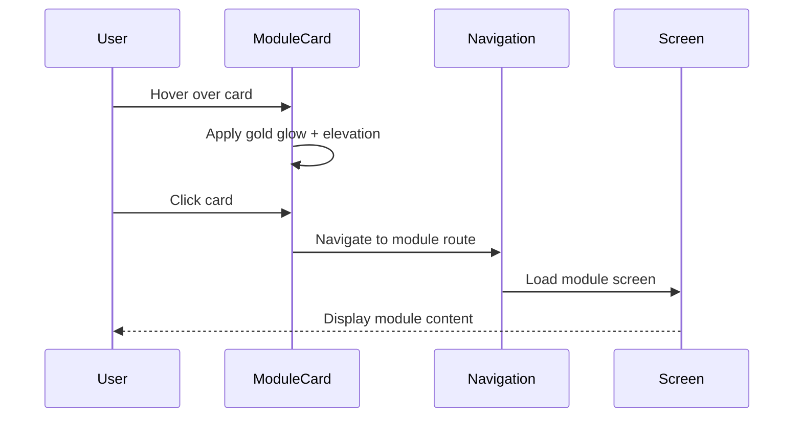

# Design Document: Admin Panel World Cup 2026 Redesign

## Overview

This design document outlines the complete technical redesign of the Admin Panel for the World Cup 2026 mobile application. The redesign focuses on transforming the existing React Native admin interface from a generic red-themed panel into a premium, stadium-inspired experience featuring World Cup 2026 visual identity with green and gold color palette.

The redesign includes removing 7 legacy modules, modernizing 4 core modules, implementing a sophisticated design system with stadium-inspired gradients and premium interactions, and ensuring full mobile-first responsiveness. The new design system emphasizes executive-level polish with smooth animations, hover states with gold glow effects, and a modern enterprise aesthetic suitable for high-level administrative operations.

## Architecture

```mermaid
graph TD
    A[Theme System] --> B[Design Tokens]
    B --> C[Component Library]
    C --> D[Screen Components]
    
    A --> E[World Cup Colors]
    A --> F[Premium Shadows]
    A --> G[Animation Config]
    
    C --> H[WorldCupHeader]
    C --> I[PremiumStatCard]
    C --> J[CountUpNumber]
    C --> K[ModuleCard]
    
    D --> L[Dashboard]
    D --> M[Users Management]
    D --> N[Slider Management]
    D --> O[Participation Tracking]
    
    L --> P[Stat Cards Grid]
    L --> Q[Participation Widget]
    L --> R[Module Cards]

## Sequence Diagrams

### Dashboard Load Flow

```mermaid
sequenceDiagram
    participant User
    participant Dashboard
    participant ThemeProvider
    participant DataStores
    participant CountUpAnimation
    
    User->>Dashboard: Navigate to Admin Panel
    Dashboard->>ThemeProvider: Get World Cup Theme
    ThemeProvider-->>Dashboard: Return green/gold colors
    Dashboard->>DataStores: Fetch users, predictions, participation
    DataStores-->>Dashboard: Return data
    Dashboard->>CountUpAnimation: Start count-up (0 → value)
    CountUpAnimation-->>Dashboard: Animate over 600ms
    Dashboard-->>User: Display premium dashboard
```

### Module Card Interaction Flow




## Components and Interfaces

### Theme System Interface

```typescript
interface WorldCup2026Colors {
  primary: string;           // #1a6b2f - World Cup Green
  primaryDark: string;       // #0d1b12
  primaryLight: string;      // #214734
  accent: string;            // #c9a84c - Gold
  accentSoft: string;        // #e0c36a
  surface: string;           // #ffffff
  surfaceAlt: string;        // #f7f8fa
  textPrimary: string;       // #111111
  textSecondary: string;     // #555555
  border: string;            // rgba(0,0,0,0.08)
  success: string;           // #1a6b2f
}

interface PremiumShadows {
  card: ShadowStyleIOS & {
    elevation: number;
  };
  cardHover: ShadowStyleIOS & {
    elevation: number;
  };
  goldGlow: ShadowStyleIOS & {
    elevation: number;
  };
}
```


### Component 1: WorldCupHeader

**Purpose**: Premium stadium-inspired header with dark gradient, gold accents, and subtle soccer ball watermark

**Interface**:
```typescript
interface WorldCupHeaderProps {
  title: string;
  subtitle?: string;
  icon?: keyof typeof MaterialCommunityIcons.glyphMap;
  onLogout?: () => void;
}

const WorldCupHeader: React.FC<WorldCupHeaderProps>;
```

**Responsibilities**:
- Render dark stadium gradient background (#0d1b12 → #1a3a20)
- Apply thin gold border bottom
- Display soccer ball watermark SVG with low opacity (0.04)
- Render admin avatar with shield-crown icon
- Provide logout button with subtle interaction
- Apply responsive typography (48px desktop → 36px tablet → 28px mobile)

### Component 2: PremiumStatCard

**Purpose**: Elevated stat card with gold accent border, count-up animation, and hover effects

**Interface**:
```typescript
interface PremiumStatCardProps {
  icon: keyof typeof MaterialCommunityIcons.glyphMap;
  value: number;
  label: string;
  color: string;
  animationDuration?: number; // default 600ms
}

const PremiumStatCard: React.FC<PremiumStatCardProps>;
```

**Responsibilities**:
- Render white card with 16px border radius
- Apply left gold accent border (3px)
- Display icon in colored circular background
- Integrate CountUpNumber component for value animation
- Apply hover elevation increase (shadows.sm → shadows.md)
- Handle smooth transitions (150ms ease-out)


### Component 3: CountUpNumber

**Purpose**: Pure React animation component for count-up effect without external libraries

**Interface**:
```typescript
interface CountUpNumberProps {
  end: number;
  duration?: number;        // default 600ms
  startDelay?: number;      // default 0ms
  easing?: (t: number) => number; // default easeOut
  style?: TextStyle;
}

const CountUpNumber: React.FC<CountUpNumberProps>;
```

**Responsibilities**:
- Animate number from 0 to end value using React state + useEffect
- Apply easeOut easing function for smooth deceleration
- Support configurable duration (default 600ms)
- Use requestAnimationFrame for 60fps performance
- Clean up animation on unmount

### Component 4: ModuleCard

**Purpose**: Interactive module card wrapper with premium hover effects and gold glow

**Interface**:
```typescript
interface ModuleCardProps {
  icon: keyof typeof MaterialCommunityIcons.glyphMap;
  title: string;
  description: string;
  color: string;
  onPress: () => void;
  disabled?: boolean;
}

const ModuleCard: React.FC<ModuleCardProps>;
```

**Responsibilities**:
- Render white surface with 18px border radius
- Apply border and base shadow
- Implement hover lift effect (transform + shadow increase)
- Add gold glow on hover (shadowColor: #c9a84c, opacity: 0.28)
- Display icon in colored circular badge
- Handle press with opacity feedback (0.8)
- Smooth transition for all interactive states (200ms)


## Data Models

### ThemeConfig Model

```typescript
interface ThemeConfig {
  worldCup2026: {
    colors: WorldCup2026Colors;
    shadows: PremiumShadows;
    gradients: {
      stadiumHeader: [string, string];
      goldAccent: [string, string];
    };
    typography: {
      dashboardTitle: {
        desktop: number;    // 48
        tablet: number;     // 36
        mobile: number;     // 28
      };
      sectionTitle: number; // 24
    };
  };
}
```

**Validation Rules**:
- All color values must be valid hex or rgba format
- Shadow elevation values must be positive integers
- Font sizes must be positive numbers

### StatCardData Model

```typescript
interface StatCardData {
  id: string;
  icon: keyof typeof MaterialCommunityIcons.glyphMap;
  value: number;
  label: string;
  color: string;
  order: number;
}
```

**Validation Rules**:
- value must be non-negative integer
- color must be valid hex color
- order must be positive integer
- label must be non-empty string


### ModuleConfig Model

```typescript
interface ModuleConfig {
  id: string;
  route: string;
  icon: keyof typeof MaterialCommunityIcons.glyphMap;
  label: string;
  description: string;
  color: string;
  enabled: boolean;
}
```

**Validation Rules**:
- route must start with "/(admin)/"
- enabled must be boolean
- All kept modules: users, slider, participation, index (dashboard)
- All removed modules must be deleted from config

## Algorithmic Pseudocode

### Count-Up Animation Algorithm

```typescript
// Count-up animation implementation
// INPUT: endValue (number), duration (number), easing function
// OUTPUT: Animated number display from 0 to endValue

function useCountUp(endValue: number, duration: number = 600): number {
  const [currentValue, setCurrentValue] = useState(0);
  
  useEffect(() => {
    let startTime: number | null = null;
    let animationFrameId: number;
    
    const easeOut = (t: number): number => {
      return 1 - Math.pow(1 - t, 3); // cubic ease-out
    };
    
    const animate = (timestamp: number) => {
      if (!startTime) startTime = timestamp;
      const elapsed = timestamp - startTime;
      const progress = Math.min(elapsed / duration, 1);
      
      const easedProgress = easeOut(progress);
      const nextValue = Math.round(easedProgress * endValue);
      
      setCurrentValue(nextValue);
      
      if (progress < 1) {
        animationFrameId = requestAnimationFrame(animate);
      }
    };
    
    animationFrameId = requestAnimationFrame(animate);
    
    return () => {
      cancelAnimationFrame(animationFrameId);
    };
  }, [endValue, duration]);
  
  return currentValue;
}
```


**Preconditions**:
- endValue is a non-negative number
- duration is a positive number (milliseconds)
- Component is mounted in React tree

**Postconditions**:
- Returns animated value from 0 to endValue
- Animation completes within specified duration
- Animation frame is cleaned up on unmount
- Uses cubic ease-out for natural deceleration

**Loop Invariants**:
- progress always in range [0, 1]
- currentValue never exceeds endValue
- Animation frame properly canceled if component unmounts

### Theme Migration Algorithm

```typescript
// Theme migration from red to green/gold
// INPUT: existing theme object
// OUTPUT: World Cup 2026 theme object

function migrateToWorldCupTheme(existingTheme: AppTheme): AppTheme {
  return {
    ...existingTheme,
    colors: {
      ...existingTheme.colors,
      // Replace primary red with World Cup green
      primary: '#1a6b2f',
      primaryDark: '#0d1b12',
      primaryLight: '#214734',
      
      // Add gold accent colors
      accent: '#c9a84c',
      accentSoft: '#e0c36a',
      
      // Update success to match primary green
      success: '#1a6b2f',
      
      // Remove all red accent references
      // Keep info, warning, error for semantic purposes
    },
    shadows: {
      ...existingTheme.shadows,
      goldGlow: {
        shadowColor: '#c9a84c',
        shadowOffset: { width: 0, height: 4 },
        shadowOpacity: 0.28,
        shadowRadius: 12,
        elevation: 8,
      },
    },
  };
}
```


**Preconditions**:
- existingTheme is a valid AppTheme object
- existingTheme.colors object exists

**Postconditions**:
- Returns valid AppTheme with World Cup colors
- All red primary colors replaced with green
- Gold accent colors added
- goldGlow shadow added to shadows object
- Original theme structure preserved

### Module Cleanup Algorithm

```typescript
// Remove obsolete admin modules
// INPUT: array of module routes
// OUTPUT: filtered array with only kept modules

function cleanupModuleRoutes(routes: string[]): string[] {
  const REMOVED_MODULES = [
    '/(admin)/news',
    '/(admin)/matches',
    '/(admin)/rewards',
    '/(admin)/settings',
    '/(admin)/reports',
    '/(admin)/images',
    '/(admin)/notifications',
  ];
  
  const KEPT_MODULES = [
    '/(admin)/index',      // Dashboard
    '/(admin)/users',      // Users Management
    '/(admin)/slider',     // Slider/Banners
    '/(admin)/participation', // Participation Tracking
  ];
  
  return routes.filter(route => 
    KEPT_MODULES.includes(route) && !REMOVED_MODULES.includes(route)
  );
}
```

**Preconditions**:
- routes is an array of valid route strings
- All routes follow the "/(admin)/[name]" pattern

**Postconditions**:
- Returns array containing only KEPT_MODULES routes
- REMOVED_MODULES routes are excluded
- Array order is preserved
- No duplicate routes in output


## Key Functions with Formal Specifications

### Function 1: applyGoldGlowOnHover()

```typescript
function applyGoldGlowOnHover(
  isHovered: boolean,
  baseStyle: ViewStyle
): ViewStyle {
  if (!isHovered) {
    return baseStyle;
  }
  
  return {
    ...baseStyle,
    shadowColor: '#c9a84c',
    shadowOffset: { width: 0, height: 4 },
    shadowOpacity: 0.28,
    shadowRadius: 12,
    elevation: 8,
    transform: [{ translateY: -2 }],
  };
}
```

**Preconditions**:
- isHovered is a boolean value
- baseStyle is a valid ViewStyle object
- baseStyle contains existing shadow properties

**Postconditions**:
- If not hovered: returns unmodified baseStyle
- If hovered: returns style with gold glow shadow applied
- Transform includes slight lift effect (-2px vertical)
- Original baseStyle is not mutated
- Shadow color is World Cup gold (#c9a84c)

**Loop Invariants**: N/A (no loops)

### Function 2: calculateResponsiveFontSize()

```typescript
function calculateResponsiveFontSize(
  screenWidth: number,
  type: 'dashboard' | 'section'
): number {
  if (type === 'dashboard') {
    if (screenWidth >= 1024) return 48;  // desktop
    if (screenWidth >= 768) return 36;   // tablet
    return 28;                           // mobile
  }
  
  if (type === 'section') {
    return 24;
  }
  
  return 16; // default
}
```


**Preconditions**:
- screenWidth is a positive number (pixels)
- type is one of: 'dashboard', 'section'

**Postconditions**:
- Returns positive number representing font size in pixels
- Dashboard titles: 48px (≥1024px), 36px (≥768px), 28px (<768px)
- Section titles: always 24px
- Default fallback: 16px
- Return value matches responsive design requirements

**Loop Invariants**: N/A (no loops)

### Function 3: filterStatCardsByModule()

```typescript
function filterStatCardsByModule(
  allCards: StatCardData[],
  removedModules: string[]
): StatCardData[] {
  const REMOVED_CARD_IDS = [
    'rewards',      // Premios module removed
    'news',         // Noticias module removed
    'images',       // Imágenes module removed
  ];
  
  return allCards.filter(card => 
    !REMOVED_CARD_IDS.includes(card.id)
  );
}
```

**Preconditions**:
- allCards is an array of valid StatCardData objects
- Each card has a unique id property
- removedModules is an array of module names

**Postconditions**:
- Returns filtered array with only 3 cards: Usuarios, Activos, Pronósticos
- Cards for removed modules (rewards, news, images) are excluded
- Card order is preserved
- Original allCards array is not mutated
- Returned array length ≤ original array length


**Loop Invariants**:
- All processed cards maintain their original properties
- Filter predicate consistently applied to each element

## Example Usage

### Example 1: Implementing WorldCupHeader Component

```typescript
import React from 'react';
import { View, Text, StyleSheet, Pressable } from 'react-native';
import { LinearGradient } from 'expo-linear-gradient';
import { MaterialCommunityIcons } from '@expo/vector-icons';

const WorldCupHeader: React.FC<WorldCupHeaderProps> = ({
  title,
  subtitle,
  icon = 'shield-crown',
  onLogout,
}) => {
  return (
    <LinearGradient
      colors={['#0d1b12', '#1a3a20']}
      style={styles.header}
    >
      {/* Soccer ball watermark - subtle background */}
      <View style={styles.watermark}>
        <MaterialCommunityIcons 
          name="soccer" 
          size={120} 
          color="rgba(255,255,255,0.04)" 
        />
      </View>
      
      <View style={styles.content}>
        <View style={styles.left}>
          <View style={styles.avatar}>
            <MaterialCommunityIcons name={icon} size={22} color="#fff" />
          </View>
          <View>
            <Text style={styles.title}>{title}</Text>
            {subtitle && <Text style={styles.subtitle}>{subtitle}</Text>}
          </View>
        </View>
        
        {onLogout && (
          <Pressable onPress={onLogout} style={styles.logoutBtn}>
            <MaterialCommunityIcons name="logout" size={18} color="#c9a84c" />
          </Pressable>
        )}
      </View>
      
      {/* Thin gold border bottom */}
      <View style={styles.goldBorder} />
    </LinearGradient>
  );
};
```


### Example 2: Implementing CountUpNumber Component

```typescript
import React, { useState, useEffect } from 'react';
import { Text, TextStyle } from 'react-native';

const CountUpNumber: React.FC<CountUpNumberProps> = ({
  end,
  duration = 600,
  startDelay = 0,
  easing = (t) => 1 - Math.pow(1 - t, 3), // cubic ease-out
  style,
}) => {
  const [current, setCurrent] = useState(0);
  
  useEffect(() => {
    let startTime: number | null = null;
    let frameId: number;
    
    const animate = (timestamp: number) => {
      if (!startTime) startTime = timestamp + startDelay;
      
      const elapsed = timestamp - startTime;
      if (elapsed < 0) {
        frameId = requestAnimationFrame(animate);
        return;
      }
      
      const progress = Math.min(elapsed / duration, 1);
      const easedProgress = easing(progress);
      const value = Math.round(easedProgress * end);
      
      setCurrent(value);
      
      if (progress < 1) {
        frameId = requestAnimationFrame(animate);
      }
    };
    
    frameId = requestAnimationFrame(animate);
    
    return () => cancelAnimationFrame(frameId);
  }, [end, duration, startDelay, easing]);
  
  return <Text style={style}>{current}</Text>;
};
```


### Example 3: Implementing PremiumStatCard with Hover

```typescript
import React, { useState } from 'react';
import { View, Text, StyleSheet, Pressable } from 'react-native';
import { MaterialCommunityIcons } from '@expo/vector-icons';

const PremiumStatCard: React.FC<PremiumStatCardProps> = ({
  icon,
  value,
  label,
  color,
  animationDuration = 600,
}) => {
  const [isHovered, setIsHovered] = useState(false);
  
  return (
    <Pressable
      onPressIn={() => setIsHovered(true)}
      onPressOut={() => setIsHovered(false)}
      style={[
        styles.card,
        isHovered && styles.cardHovered,
      ]}
    >
      {/* Left gold accent border */}
      <View style={[styles.accentBorder, { backgroundColor: '#c9a84c' }]} />
      
      <View style={[styles.iconBox, { backgroundColor: `${color}18` }]}>
        <MaterialCommunityIcons name={icon} size={24} color={color} />
      </View>
      
      <CountUpNumber 
        end={value} 
        duration={animationDuration}
        style={[styles.value, { color: '#c9a84c' }]} 
      />
      
      <Text style={styles.label}>{label}</Text>
    </Pressable>
  );
};

const styles = StyleSheet.create({
  card: {
    backgroundColor: '#ffffff',
    borderRadius: 16,
    padding: 16,
    borderWidth: 1,
    borderColor: 'rgba(0,0,0,0.08)',
    alignItems: 'center',
    position: 'relative',
    shadowColor: '#000',
    shadowOffset: { width: 0, height: 2 },
    shadowOpacity: 0.08,
    shadowRadius: 4,
    elevation: 2,
    transition: 'all 150ms ease-out',
  },
  cardHovered: {
    shadowColor: '#c9a84c',
    shadowOffset: { width: 0, height: 4 },
    shadowOpacity: 0.28,
    shadowRadius: 12,
    elevation: 8,
    transform: [{ translateY: -2 }],
  },
  accentBorder: {
    position: 'absolute',
    left: 0,
    top: 0,
    bottom: 0,
    width: 3,
    borderTopLeftRadius: 16,
    borderBottomLeftRadius: 16,
  },
  // ... other styles
});
```


### Example 4: Updating Theme Configuration

```typescript
// mobile/src/theme/theme.ts
export const worldCup2026Colors = {
  primary: '#1a6b2f',        // World Cup Green
  primaryDark: '#0d1b12',
  primaryLight: '#214734',
  accent: '#c9a84c',         // Gold
  accentSoft: '#e0c36a',
  surface: '#ffffff',
  surfaceAlt: '#f7f8fa',
  textPrimary: '#111111',
  textSecondary: '#555555',
  border: 'rgba(0,0,0,0.08)',
  success: '#1a6b2f',
};

export const premiumShadows = {
  card: {
    shadowColor: '#000',
    shadowOffset: { width: 0, height: 2 },
    shadowOpacity: 0.08,
    shadowRadius: 4,
    elevation: 2,
  },
  cardHover: {
    shadowColor: '#000',
    shadowOffset: { width: 0, height: 4 },
    shadowOpacity: 0.15,
    shadowRadius: 8,
    elevation: 5,
  },
  goldGlow: {
    shadowColor: '#c9a84c',
    shadowOffset: { width: 0, height: 4 },
    shadowOpacity: 0.28,
    shadowRadius: 12,
    elevation: 8,
  },
};

// Update existing theme object
export const lightTheme = {
  ...lightTheme,
  colors: {
    ...lightTheme.colors,
    primary: worldCup2026Colors.primary,
    primaryLight: worldCup2026Colors.primaryLight,
    success: worldCup2026Colors.success,
  },
};
```


## Correctness Properties

### Universal Quantification Statements

**Property 1: Color Consistency**
```
∀ component ∈ AdminPanelComponents:
  component.primaryColor = '#1a6b2f' ∧
  component.accentColor = '#c9a84c' ∧
  component.redAccents = ∅
```
All admin panel components use World Cup green as primary and gold as accent, with no red accents remaining.

**Property 2: Module Cleanup**
```
∀ route ∈ AdminRoutes:
  route ∈ KEPT_MODULES ⟺ route.visible = true ∧
  route ∈ REMOVED_MODULES ⟺ route.exists = false
```
All routes are either in the kept modules set (visible) or removed modules set (deleted from codebase).

**Property 3: Animation Performance**
```
∀ animation ∈ CountUpAnimations:
  animation.duration ≤ 600ms ∧
  animation.framerate = 60fps ∧
  animation.easing = easeOut
```
All count-up animations complete within 600ms, run at 60fps, and use ease-out easing.

**Property 4: Responsive Typography**
```
∀ screen ∈ AdminScreens:
  screen.width < 768 → titleFontSize = 28 ∧
  768 ≤ screen.width < 1024 → titleFontSize = 36 ∧
  screen.width ≥ 1024 → titleFontSize = 48
```
Typography scales correctly based on screen width breakpoints.

**Property 5: Hover Effects**
```
∀ card ∈ InteractiveCards:
  card.hovered = true →
    card.shadow = goldGlow ∧
    card.elevation > card.baseElevation ∧
    card.transform.y < 0
```
All interactive cards apply gold glow shadow and lift effect when hovered.


**Property 6: Stat Card Count**
```
∀ dashboard ∈ AdminDashboards:
  |dashboard.statCards| = 3 ∧
  dashboard.statCards = {Usuarios, Activos, Pronósticos}
```
Dashboard displays exactly 3 stat cards after removing obsolete modules.

**Property 7: Shadow Elevation Hierarchy**
```
∀ card ∈ Cards:
  card.baseElevation < card.hoverElevation ∧
  card.goldGlowElevation ≥ card.hoverElevation
```
Shadow elevations follow proper visual hierarchy: base < hover ≤ goldGlow.

## Error Handling

### Error Scenario 1: Animation Frame Cleanup

**Condition**: Component unmounts during count-up animation
**Response**: Cancel active requestAnimationFrame to prevent memory leak
**Recovery**: useEffect cleanup function cancels frame ID before unmount

### Error Scenario 2: Invalid Theme Color

**Condition**: Theme color value is not a valid hex or rgba format
**Response**: Fall back to default World Cup green (#1a6b2f)
**Recovery**: Validate color format with regex, use fallback on failure

### Error Scenario 3: Missing Module Route

**Condition**: User attempts to navigate to removed module route
**Response**: Redirect to dashboard with error toast
**Recovery**: Route guard checks if route exists in KEPT_MODULES, redirects if not

### Error Scenario 4: Hover State on Mobile

**Condition**: Mobile device doesn't support hover interactions
**Response**: Use onPressIn/onPressOut for touch feedback instead
**Recovery**: Detect touch device, apply press states rather than hover states


### Error Scenario 5: Animation Duration Edge Cases

**Condition**: Duration value is 0, negative, or extremely large
**Response**: Clamp duration to safe range [100ms, 2000ms]
**Recovery**: Validate duration parameter, apply min/max bounds before animation

## Testing Strategy

### Unit Testing Approach

**Test Coverage Goals**: 90%+ coverage for utility functions and algorithms

**Key Test Cases**:

1. **CountUpNumber Component**
   - Test animation completes in specified duration
   - Test final value matches end prop
   - Test cleanup on unmount prevents memory leaks
   - Test easing function produces smooth progression
   - Test edge cases: 0, negative, large numbers

2. **Theme Migration**
   - Test all red colors replaced with green
   - Test gold accent colors added correctly
   - Test existing theme structure preserved
   - Test invalid color formats handled gracefully

3. **Module Cleanup**
   - Test exactly 4 kept modules remain
   - Test exactly 7 removed modules deleted
   - Test route filtering produces correct array
   - Test no duplicate routes in output

4. **Responsive Typography**
   - Test font sizes at 767px, 768px, 1023px, 1024px breakpoints
   - Test mobile, tablet, desktop sizes correct
   - Test fallback to default 16px for unknown types

5. **Gold Glow Hover Effect**
   - Test shadow properties applied on hover
   - Test transform includes -2px vertical lift
   - Test base style not mutated
   - Test proper cleanup on hover end


### Property-Based Testing Approach

**Property Test Library**: fast-check (JavaScript/TypeScript property-based testing)

**Property Tests**:

1. **Color Format Validation**
   - Property: Any color string in theme must be valid hex or rgba
   - Generator: Produce random hex/rgba strings
   - Assertion: validateColorFormat(color) returns true for all theme colors

2. **Animation Progress Monotonicity**
   - Property: Animation progress always increases monotonically
   - Generator: Random end values and durations
   - Assertion: For all frames, progress[n] ≥ progress[n-1]

3. **Shadow Elevation Hierarchy**
   - Property: Hover elevation always exceeds base elevation
   - Generator: Random shadow configurations
   - Assertion: hover.elevation > base.elevation

4. **Responsive Breakpoint Coverage**
   - Property: All screen widths map to exactly one font size
   - Generator: Random screen widths [0, 3000]
   - Assertion: calculateResponsiveFontSize returns valid size for all widths

5. **Module Route Filtering Idempotence**
   - Property: Filtering routes twice produces same result as filtering once
   - Generator: Random arrays of route strings
   - Assertion: cleanupModuleRoutes(cleanupModuleRoutes(x)) = cleanupModuleRoutes(x)

### Integration Testing Approach

**Integration Test Scenarios**:

1. **Theme Provider Integration**
   - Test WorldCupHeader renders with correct theme colors
   - Test PremiumStatCard uses theme shadows
   - Test ModuleCard applies theme hover effects

2. **Dashboard Module Integration**
   - Test stat cards render with count-up animations
   - Test module cards navigate to correct routes
   - Test participation widget displays correct data

3. **Navigation Integration**
   - Test all kept module routes are accessible
   - Test removed module routes are inaccessible
   - Test navigation guards redirect properly


4. **Responsive Layout Integration**
   - Test mobile layout (< 768px): single column, stacked cards
   - Test tablet layout (768px-1023px): 2 column grid
   - Test desktop layout (≥ 1024px): full dashboard layout
   - Test no horizontal overflow at any breakpoint

5. **Animation Performance Integration**
   - Test count-up animations run at 60fps
   - Test multiple simultaneous animations don't degrade performance
   - Test animations clean up properly on navigation

## Performance Considerations

### Optimization Strategies

1. **Animation Performance**
   - Use requestAnimationFrame for 60fps animations
   - Memoize easing function to avoid recreating on each frame
   - Cancel animation frames on component unmount
   - Batch state updates within animation loop

2. **Component Rendering**
   - Memoize expensive calculations (stats, filtered arrays)
   - Use React.memo for pure presentational components
   - Avoid inline function creation in render
   - Use useMemo/useCallback for stable references

3. **Shadow Rendering**
   - Use elevation property on Android for native shadows
   - Apply shadows only to visible components
   - Reduce shadow complexity on lower-end devices
   - Cache shadow style objects

4. **Image Assets**
   - Use SVG for soccer ball watermark (scalable, small file size)
   - Optimize gradient performance with native LinearGradient
   - Lazy load module card icons
   - Use proper image formats (WebP where supported)

5. **State Management**
   - Avoid unnecessary re-renders from theme changes
   - Batch multiple state updates in event handlers
   - Use local state for UI-only concerns (hover, animations)
   - Lift shared state to appropriate level


### Performance Metrics

- **Target Load Time**: < 300ms for dashboard render
- **Animation Frame Rate**: Consistent 60fps for count-up animations
- **Memory Usage**: < 50MB increase for admin panel session
- **Touch Response**: < 100ms feedback for all interactive elements
- **Bundle Size Impact**: < 15KB increase for new components

## Security Considerations

### Security Requirements

1. **Route Protection**
   - Verify admin role before rendering any admin component
   - Redirect non-admin users to main app
   - Maintain route guards at layout level
   - No sensitive data exposed in removed module cleanup

2. **Data Access Control**
   - Admin operations require proper authentication
   - User management actions logged for audit trail
   - Stat card data sanitized before display
   - No PII exposed in error messages

3. **Component Security**
   - Validate all user inputs in forms
   - Sanitize data before rendering in Text components
   - Prevent XSS through proper React rendering
   - No eval() or dangerous code execution

4. **Theme Security**
   - Color values validated to prevent injection
   - No external CSS loaded from untrusted sources
   - Style objects created from trusted constants only
   - No inline styles from user input

### Threat Mitigation Strategies

- **Unauthorized Access**: Route guards + role verification
- **Data Tampering**: Immutable theme constants, validated inputs
- **Information Disclosure**: Removed modules deleted completely, no remnants
- **Injection Attacks**: All text properly escaped by React


## Dependencies

### Existing Dependencies (No Changes)

- **react-native**: Core framework
- **expo**: Development platform
- **expo-router**: Navigation
- **expo-linear-gradient**: Gradient backgrounds for header
- **@expo/vector-icons**: Material Community Icons
- **react**: Core React library

### No New External Dependencies Required

The redesign leverages existing dependencies and pure React implementations:

- **Count-up animations**: Implemented with pure React (useState + useEffect + requestAnimationFrame)
- **Hover effects**: Native Pressable component with state management
- **Gradients**: Existing expo-linear-gradient
- **Icons**: Existing @expo/vector-icons
- **Shadows**: Native React Native shadow properties

### Internal Dependencies

- **mobile/src/theme/theme.ts**: Extended with World Cup 2026 colors
- **mobile/src/components/**: New reusable components created
- **mobile/src/features/admin/**: Screen components updated
- **mobile/app/(admin)/**: Route files cleaned up

### Configuration Files

- **package.json**: No changes required
- **tsconfig.json**: No changes required
- **app.json**: No changes required

## Implementation Notes

### File Structure Changes

**New Files to Create**:
```
mobile/src/components/WorldCupHeader.tsx
mobile/src/components/PremiumStatCard.tsx
mobile/src/components/CountUpNumber.tsx
mobile/src/components/ModuleCard.tsx
```

**Files to Update**:
```
mobile/src/theme/theme.ts (add World Cup 2026 colors)
mobile/src/features/admin/screens/AdminDashboardScreen.tsx
mobile/src/features/admin/screens/UsersManagementScreen.tsx
mobile/src/features/admin/screens/SliderManagementScreen.tsx
mobile/src/features/admin/screens/ParticipationTrackingScreen.tsx
mobile/app/(admin)/_layout.tsx
```


**Files to Delete**:
```
mobile/src/features/admin/screens/NewsManagementScreen.tsx
mobile/src/features/admin/screens/MatchesManagementScreen.tsx
mobile/src/features/admin/screens/RewardsManagementScreen.tsx
mobile/src/features/admin/screens/SettingsScreen.tsx
mobile/src/features/admin/screens/ReportsScreen.tsx
mobile/src/features/admin/screens/ImageManagementScreen.tsx
mobile/src/features/admin/screens/NotificationsManagementScreen.tsx
mobile/app/(admin)/news.tsx
mobile/app/(admin)/matches.tsx
mobile/app/(admin)/rewards.tsx
mobile/app/(admin)/settings.tsx
mobile/app/(admin)/reports.tsx
mobile/app/(admin)/images.tsx
mobile/app/(admin)/notifications.tsx
```

### Migration Checklist

- [ ] Update theme.ts with World Cup 2026 colors
- [ ] Create new reusable components (WorldCupHeader, PremiumStatCard, CountUpNumber, ModuleCard)
- [ ] Update AdminDashboardScreen with new design
- [ ] Update UsersManagementScreen styling
- [ ] Update SliderManagementScreen styling
- [ ] Update ParticipationTrackingScreen styling
- [ ] Clean up _layout.tsx routes
- [ ] Delete obsolete screen files
- [ ] Delete obsolete route files
- [ ] Test responsive layouts (mobile, tablet, desktop)
- [ ] Test count-up animations
- [ ] Test hover/press interactions
- [ ] Verify no red accents remain
- [ ] Performance testing (60fps animations)
- [ ] Accessibility testing (WCAG compliance)

### Rollout Strategy

1. **Phase 1: Theme Foundation**
   - Update theme.ts with new color palette
   - Create base component library
   - Test theme switching works correctly

2. **Phase 2: Component Migration**
   - Migrate dashboard to new design
   - Update kept module screens
   - Test each screen individually

3. **Phase 3: Cleanup**
   - Remove obsolete modules
   - Clean up navigation
   - Remove dead code and imports

4. **Phase 4: Polish**
   - Fine-tune animations
   - Optimize performance
   - Accessibility improvements
   - User acceptance testing
