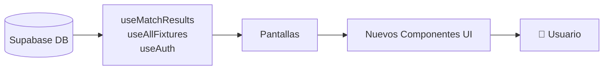
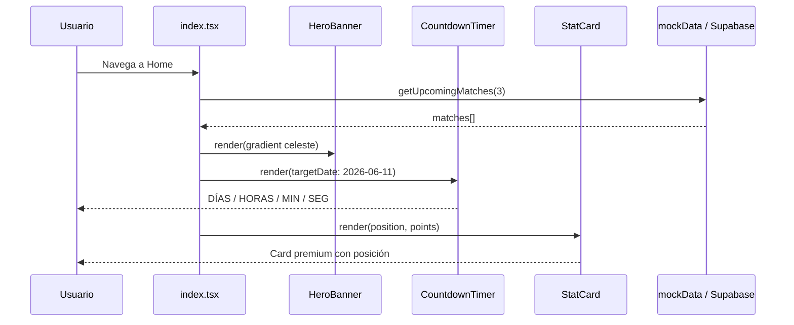
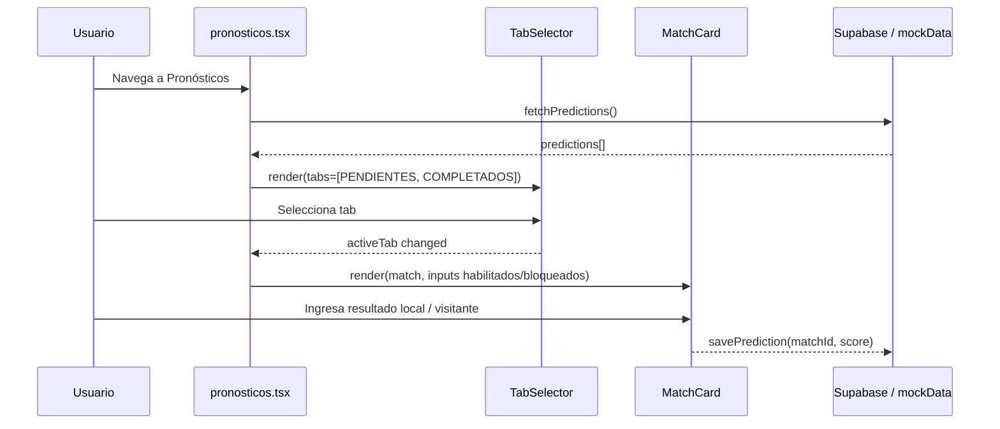
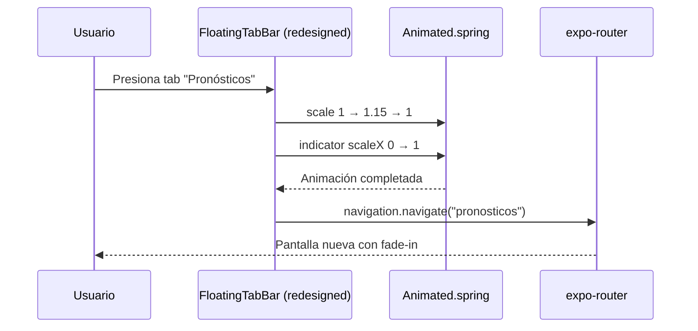

# Design Document: frontend-redesign-mundial-2026

## Overview

Refactorización completa de la capa visual del frontend mobile (React Native / Expo + TypeScript) de la aplicación "Prode GrupoNúcleo". Se reemplaza la identidad visual rojo/negro (#CC2627) por una estética premium inspirada en la Selección Argentina y el Mundial FIFA 2026, usando la paleta celeste/azul profundo. **Sin modificar ninguna capa de lógica de negocio, servicios, hooks de datos, autenticación ni backend.**

La estrategia es: (1) reemplazar el sistema de tokens de diseño (`theme.ts`), (2) crear nuevos componentes visuales en `mobile/src/components/`, (3) refactorizar los layouts de pantalla en `mobile/app/(app)/`.

---

## Architecture

### Capas del sistema (solo frontend)

```mermaid
graph TD
    A[app/(app)/_layout.tsx<br/>Bottom Tab Navigation] --> B[Screens]
    B --> B1[index.tsx — Home]
    B --> B2[pronosticos.tsx — Pronósticos ⭐]
    B --> B3[fixture.tsx — Fixture]
    B --> B4[posiciones.tsx — Ranking]
    B --> B5[perfil.tsx — Perfil]
    B --> B6[details/detalle-partido.tsx]

    subgraph "Design System (NUEVO)"
        C[mobile/src/theme/]
        C1[colors.ts — Paleta Mundial 2026]
        C2[typography.ts — Poppins scale]
        C3[spacing.ts — Escala 8px]
        C4[shadows.ts — Sombras celestes]
        C5[borderRadius.ts — Tokens radius]
        C --> C1
        C --> C2
        C --> C3
        C --> C4
        C --> C5
    end

    subgraph "Nuevos Componentes (mobile/src/components/)"
        D1[MatchCard — Pronósticos con inputs]
        D2[MatchFixtureCard — Fixture sin inputs]
        D3[RankingRow — Fila de ranking]
        D4[PodiumCard — Top 3]
        D5[CountdownTimer — Contador regresivo]
        D6[HeroBanner — Banner gradiente celeste]
        D7[SectionHeader — Header con fecha]
        D8[TabSelector — Pestañas COMP/PEND]
        D9[SkeletonLoader — Loading skeleton]
        D10[PrizeCard — Card de premios]
        D11[StatCard — Card estadística personal]
    end

    B --> D1
    B --> D2
    B --> D3
    B --> D6
    C1 --> D1
    C1 --> D2
```

### Flujo de datos (sin cambios)



> **Restricción crítica**: Los hooks de datos, providers (`AuthProvider`, `ThemeProvider`), servicios y toda la lógica de negocio permanecen intactos. Solo se toca la capa de presentación.

---

## Sequence Diagrams

### Flujo: Pantalla Home con Countdown



### Flujo: Pantalla Pronósticos



### Flujo: Bottom Tab Bar con animaciones



---

## Components and Interfaces

### Design Token System

#### `colors.ts`

```typescript
export const Colors = {
  // Paleta principal Mundial 2026
  primary: '#6EC6FF',        // Celeste principal
  primarySecondary: '#BFE9FF', // Celeste claro
  primaryDark: '#3DA5F5',    // Celeste oscuro
  deepBlue: '#0F4C81',       // Azul profundo
  white: '#FFFFFF',
  grayLight: '#F5F7FA',

  // Texto
  textPrimary: '#1D1D1D',
  textSecondary: '#6B7280',

  // Semánticos
  success: '#22C55E',
  error: '#EF4444',
  warning: '#F59E0B',

  // Gradientes celestes
  gradientHero: ['#6EC6FF', '#3DA5F5', '#0F4C81'] as string[],
  gradientCard: ['#BFE9FF', '#6EC6FF'] as string[],
  gradientTab: ['rgba(110,198,255,0.15)', 'rgba(15,76,129,0.05)'] as string[],
} as const

export type ColorKey = keyof typeof Colors
```

#### `typography.ts`

```typescript
import { TextStyle } from 'react-native'

export const Typography = {
  // Escala de tamaños con Poppins
  hero:    { fontSize: 28, fontWeight: '700', fontFamily: 'Poppins_700Bold' } as TextStyle,
  h1:      { fontSize: 24, fontWeight: '700', fontFamily: 'Poppins_700Bold' } as TextStyle,
  h2:      { fontSize: 20, fontWeight: '600', fontFamily: 'Poppins_600SemiBold' } as TextStyle,
  h3:      { fontSize: 18, fontWeight: '600', fontFamily: 'Poppins_600SemiBold' } as TextStyle,
  body:    { fontSize: 15, fontWeight: '400', fontFamily: 'Poppins_400Regular' } as TextStyle,
  bodyMd:  { fontSize: 15, fontWeight: '500', fontFamily: 'Poppins_500Medium' } as TextStyle,
  caption: { fontSize: 12, fontWeight: '400', fontFamily: 'Poppins_400Regular' } as TextStyle,
  label:   { fontSize: 13, fontWeight: '600', fontFamily: 'Poppins_600SemiBold' } as TextStyle,
  score:   { fontSize: 22, fontWeight: '700', fontFamily: 'Poppins_700Bold' } as TextStyle,
} as const
```

#### `shadows.ts`

```typescript
export const Shadows = {
  card: {
    shadowColor: '#6EC6FF',
    shadowOffset: { width: 0, height: 2 },
    shadowOpacity: 0.10,
    shadowRadius: 8,
    elevation: 3,
  },
  cardHover: {
    shadowColor: '#3DA5F5',
    shadowOffset: { width: 0, height: 4 },
    shadowOpacity: 0.18,
    shadowRadius: 12,
    elevation: 6,
  },
  tabBar: {
    shadowColor: '#0F4C81',
    shadowOffset: { width: 0, height: -3 },
    shadowOpacity: 0.12,
    shadowRadius: 16,
    elevation: 12,
  },
  glow: {
    shadowColor: '#6EC6FF',
    shadowOffset: { width: 0, height: 0 },
    shadowOpacity: 0.35,
    shadowRadius: 16,
    elevation: 8,
  },
} as const
```

#### `borderRadius.ts`

```typescript
export const BorderRadius = {
  sm:   8,
  md:   12,
  lg:   16,
  xl:   20,
  card: 24,   // Cards de partido
  pill: 100,  // Badges y tabs
} as const
```

---

### Componentes Nuevos

#### `HeroBanner`

**Purpose**: Banner principal de la pantalla Home con gradiente celeste, texto "EL MUNDIAL SE JUEGA ACÁ" y contador regresivo.

**Interface**:
```typescript
interface HeroBannerProps {
  title: string
  subtitle?: string
  onPress?: () => void
  showCountdown?: boolean
  targetDate?: Date      // Por defecto: 2026-06-11
}
```

**Responsibilities**:
- Renderizar un `LinearGradient` con `Colors.gradientHero`
- Si `showCountdown=true`, incluir `CountdownTimer` embebido
- Área táctil mínima garantizada (44×44px en CTA)
- Accesibilidad: `accessibilityLabel`, `accessibilityRole="button"`

---

#### `CountdownTimer`

**Purpose**: Contador regresivo hasta el inicio del Mundial FIFA 2026 (11 de junio de 2026).

**Interface**:
```typescript
interface CountdownTimerProps {
  targetDate: Date
  style?: ViewStyle
  compact?: boolean   // Modo compacto para embedded en HeroBanner
}

interface TimeUnit {
  value: number
  label: 'DÍAS' | 'HORAS' | 'MIN' | 'SEG'
}
```

**Responsibilities**:
- Calcular diferencia de tiempo en tiempo real con `setInterval(1000)`
- Limpiar interval en `useEffect` cleanup
- Mostrar 4 cards: DÍAS / HORAS / MIN / SEG
- Animar cambios de número con `Animated.spring`

---

#### `MatchCard` (Pronósticos)

**Purpose**: Card de partido con inputs de pronóstico. Es el componente más importante de la app.

**Interface**:
```typescript
interface MatchCardProps {
  matchId: string | number
  homeTeam: string
  awayTeam: string
  homeCode: string
  awayCode: string
  homeLogo?: string
  awayLogo?: string
  date: string
  time: string
  group?: string
  phase?: string
  isCompleted?: boolean      // Si ya tiene pronóstico guardado
  homeScore?: number | null  // Resultado real (si partido finalizado)
  awayScore?: number | null
  userHomePred?: number      // Pronóstico del usuario
  userAwayPred?: number
  status?: 'pending' | 'live' | 'finished'
  onSave?: (matchId: string | number, home: number, away: number) => void
  onPress?: () => void
}
```

**Responsibilities**:
- Card blanca, border-radius 24px, sombra muy suave
- Banderas de equipos (emoji o imagen)
- Inputs grandes (mínimo 48×48px) centrados para resultado
- Si `isCompleted=true`: mostrar pronóstico guardado en modo lectura con color de resultado (verde=ganó, rojo=perdió, amarillo=empate)
- Validación: solo dígitos, máximo 2 dígitos por input
- `accessibilityLabel` en cada input ("Goles local", "Goles visitante")

---

#### `MatchFixtureCard`

**Purpose**: Card de partido para la pantalla Fixture, sin inputs de pronóstico.

**Interface**:
```typescript
interface MatchFixtureCardProps {
  matchId: string | number
  homeTeam: string
  awayTeam: string
  homeCode: string
  awayCode: string
  homeLogo?: string
  awayLogo?: string
  homeScore?: number | null
  awayScore?: number | null
  date: string
  time: string
  stadium?: string
  group?: string
  status: 'NS' | 'LIVE' | 'FT' | '1H' | '2H' | 'ET' | 'PEN'
  elapsed?: number | null
  isLive?: boolean
  isFinished?: boolean
  onPress?: () => void
}
```

**Responsibilities**:
- Misma estructura visual que `MatchCard` pero sin inputs
- Si `isLive=true`: borde verde animado con pulsación
- Badge de estado (EN VIVO / FT / horario)
- Navegar a `detalle-partido` al presionar

---

#### `RankingRow`

**Purpose**: Fila individual de la tabla de posiciones.

**Interface**:
```typescript
interface RankingRowProps {
  position: number
  name: string
  avatarInitials?: string
  avatarUrl?: string
  points: number
  matchesPlayed?: number
  exactPredictions?: number
  variation?: number
  variationDirection?: 'up' | 'down' | 'neutral'
  isCurrent?: boolean   // Usuario logueado — resaltar
  badge?: 'gold' | 'silver' | 'bronze'
}
```

**Responsibilities**:
- Si `isCurrent=true`: fondo celeste suave, borde celeste, sombra glow
- Medallas emoji para top 3 (🥇🥈🥉)
- Flecha de variación con color semántico (verde/rojo/gris)

---

#### `PodiumCard`

**Purpose**: Podio visual (top 3) en la pantalla de Ranking.

**Interface**:
```typescript
interface PodiumCardProps {
  first: RankingRowProps
  second: RankingRowProps
  third: RankingRowProps
}
```

**Responsibilities**:
- Layout de podio: 2do (izq, altura media), 1ro (centro, más alto), 3ro (der, más bajo)
- Coronas y medallas animadas al montar
- Colores premium: oro (#F59E0B), plata (#9CA3AF), bronce (#D97706)

---

#### `TabSelector`

**Purpose**: Pestañas para filtrar entre COMPLETADOS y PENDIENTES en Pronósticos.

**Interface**:
```typescript
interface TabSelectorProps {
  tabs: string[]
  activeTab: string
  onChange: (tab: string) => void
  style?: ViewStyle
  counts?: Record<string, number>  // Badges con cantidad
}
```

**Responsibilities**:
- Tab activo: fondo `Colors.primary`, texto blanco
- Tab inactivo: fondo `Colors.grayLight`, texto `Colors.textSecondary`
- Animación `Animated.spring` al cambiar tab
- Si `counts` proporcionado: badge circular con número

---

#### `SectionHeader`

**Purpose**: Encabezado de sección con fecha y línea separadora.

**Interface**:
```typescript
interface SectionHeaderProps {
  date: string        // "Jueves 12 Jun" o "Grupo A"
  subtitle?: string   // "3 partidos" o fase
  style?: ViewStyle
}
```

---

#### `SkeletonLoader`

**Purpose**: Placeholder animado mientras cargan los datos.

**Interface**:
```typescript
interface SkeletonLoaderProps {
  variant: 'match-card' | 'ranking-row' | 'profile' | 'banner'
  count?: number   // Cuántos esqueletos mostrar (default: 3)
}
```

**Responsibilities**:
- Animación shimmer con `Animated.loop` + `LinearGradient`
- Forma y tamaño equivalentes al componente real

---

#### `PrizeCard`

**Purpose**: Card horizontal de premios en pantalla Home.

**Interface**:
```typescript
interface PrizeCardProps {
  title: string        // "Premio Diario" / "Premio Final"
  amount: string       // "$5.000" / "$50.000"
  description?: string
  icon?: string        // Emoji o nombre de icono
  variant: 'daily' | 'final'
}
```

---

#### `StatCard`

**Purpose**: Card compacta para mostrar estadística personal (posición, puntos, racha).

**Interface**:
```typescript
interface StatCardProps {
  label: string
  value: string | number
  icon?: string
  trend?: 'up' | 'down' | 'neutral'
  color?: string
}
```

---

## Data Models

### Tokens del Design System

```typescript
// mobile/src/theme/index.ts — barrel export
export { Colors } from './colors'
export { Typography } from './typography'
export { Shadows } from './shadows'
export { BorderRadius } from './borderRadius'
export { spacing, radius } from './spacing'

// Extender el tema existente preservando providers
export interface MundialTheme {
  colors: typeof Colors
  typography: typeof Typography
  shadows: typeof Shadows
  borderRadius: typeof BorderRadius
}
```

### Actualización de `lightTheme` en `theme.ts`

```typescript
// Solo se actualizan los valores de color — la estructura del tema NO cambia
// para no romper ningún provider ni hook existente
export const lightTheme = {
  name: 'light' as const,
  isDark: false,
  colors: {
    background: Colors.grayLight,     // era '#F5F5F5'
    surface: Colors.white,
    surfaceAlt: '#F0F8FF',            // era '#FAFAFA'
    text: Colors.textPrimary,         // era neutral[900]
    textSecondary: Colors.textSecondary,
    textTertiary: '#9CA3AF',
    muted: '#9CA3AF',
    primary: Colors.primary,          // era '#CC2627' → '#6EC6FF'
    primaryLight: '#EBF5FF',
    border: '#E8F4FD',                // era neutral[200]
    divider: '#F0F9FF',
    placeholder: '#9CA3AF',
    success: Colors.success,
    warning: Colors.warning,
    error: Colors.error,
    info: Colors.primaryDark,
    overlay: 'rgba(15, 76, 129, 0.5)', // era rgba(0,0,0,0.5)
  },
}
```

---

## Algorithmic Pseudocode

### Algoritmo: CountdownTimer

```typescript
ALGORITHM CountdownTimer(targetDate: Date): TimeUnit[]

PRECONDITIONS:
  - targetDate > new Date()

POSTCONDITIONS:
  - Returns array of 4 TimeUnit with values >= 0
  - Values update every 1000ms via setInterval
  - Interval is cleaned on unmount

LOOP INVARIANT:
  - totalMs >= 0 (clamped to 0 when expired)

BEGIN
  const [units, setUnits] = useState<TimeUnit[]>(calculateUnits(targetDate))

  useEffect(() => {
    const interval = setInterval(() => {
      const now = new Date()
      const totalMs = Math.max(0, targetDate.getTime() - now.getTime())

      const days  = Math.floor(totalMs / (1000 * 60 * 60 * 24))
      const hours = Math.floor((totalMs % (1000 * 60 * 60 * 24)) / (1000 * 60 * 60))
      const mins  = Math.floor((totalMs % (1000 * 60 * 60)) / (1000 * 60))
      const secs  = Math.floor((totalMs % (1000 * 60)) / 1000)

      setUnits([
        { value: days,  label: 'DÍAS' },
        { value: hours, label: 'HORAS' },
        { value: mins,  label: 'MIN' },
        { value: secs,  label: 'SEG' },
      ])
    }, 1000)

    return () => clearInterval(interval)  // CLEANUP: evitar memory leak
  }, [targetDate])

  RETURN units
END
```

### Algoritmo: MatchCard Input Validation

```typescript
ALGORITHM validateScoreInput(raw: string): number | null

PRECONDITIONS:
  - raw is string (may be empty)

POSTCONDITIONS:
  - Returns integer 0-99 or null if invalid
  - No leading zeros (except "0" itself)

BEGIN
  IF raw === '' THEN RETURN null END IF

  const digits = raw.replace(/[^0-9]/g, '')  // Strip non-digits

  IF digits.length === 0 THEN RETURN null END IF
  IF digits.length > 2 THEN RETURN null END IF   // Max 2 digits

  const num = parseInt(digits, 10)

  IF isNaN(num) OR num < 0 THEN RETURN null END IF
  IF num > 99 THEN RETURN null END IF

  RETURN num
END
```

### Algoritmo: TabSelector con animación

```typescript
ALGORITHM TabSelector.handleChange(newTab: string)

PRECONDITIONS:
  - newTab ∈ props.tabs

POSTCONDITIONS:
  - activeTab === newTab
  - Indicator animated to new position
  - onChange(newTab) called

BEGIN
  const indicatorX = useRef(new Animated.Value(getTabOffset(activeTab))).current

  FUNCTION animateTo(tab: string):
    const targetX = getTabOffset(tab)
    Animated.spring(indicatorX, {
      toValue: targetX,
      useNativeDriver: true,
      damping: 18,
      stiffness: 220,
    }).start()
  END FUNCTION

  FUNCTION handlePress(tab: string):
    IF tab === activeTab THEN RETURN END IF
    animateTo(tab)
    onChange(tab)
  END FUNCTION

  RETURN handlePress
END
```

### Algoritmo: SkeletonLoader shimmer

```typescript
ALGORITHM SkeletonShimmer(): Animated.Value

PRECONDITIONS:
  - Component is mounted

POSTCONDITIONS:
  - shimmerAnim cycles between 0 and 1 indefinitely
  - Loop is stopped on unmount

BEGIN
  const shimmerAnim = useRef(new Animated.Value(0)).current

  useEffect(() => {
    const loop = Animated.loop(
      Animated.sequence([
        Animated.timing(shimmerAnim, { toValue: 1, duration: 900, useNativeDriver: true }),
        Animated.timing(shimmerAnim, { toValue: 0, duration: 900, useNativeDriver: true }),
      ])
    )
    loop.start()
    return () => loop.stop()  // CLEANUP
  }, [])

  const opacity = shimmerAnim.interpolate({
    inputRange: [0, 1],
    outputRange: [0.4, 1.0],
  })

  RETURN opacity  // Apply to skeleton View
END
```

---

## Key Functions with Formal Specifications

### `updateThemeColors()`

```typescript
function updateThemeColors(theme: AppTheme): AppTheme
```

**Preconditions:**
- `theme` is a valid `AppTheme` object
- `theme.colors.primary` exists

**Postconditions:**
- Returns new theme with `primary` set to `#6EC6FF` (en lugar de `#CC2627`)
- All existing color keys remain present (no breaking changes)
- `shadows.glow` uses `#6EC6FF` instead of `#CC2627`

**Loop Invariants:** N/A

---

### `FloatingTabBar` (updated)

```typescript
function FloatingTabBar(props: TabBarProps): JSX.Element
```

**Preconditions:**
- `props.state.routes` length >= 1
- `props.navigation.navigate` is callable

**Postconditions:**
- Renders 5 tab items (Inicio, Fixture, Pronósticos, Ranking, Perfil)
- Active tab shows celeste indicator and icon color
- Each tab has `accessibilityRole="tab"` and `accessibilityLabel`
- Tab bar has blur effect (iOS) / semi-transparent background (Android)

---

### `HeroBanner`

```typescript
function HeroBanner(props: HeroBannerProps): JSX.Element
```

**Preconditions:**
- `props.title` is non-empty string
- If `props.showCountdown=true`, `props.targetDate` must be future date

**Postconditions:**
- Renders `LinearGradient` with `Colors.gradientHero`
- If `showCountdown=true`: renders `CountdownTimer` component
- Touch area >= 44×44px
- Text contrast ratio >= 4.5:1 (WCAG AA) — white on celeste gradient

---

## Example Usage

### Home Screen refactorizado

```typescript
// app/(app)/index.tsx — fragmento principal
import { HeroBanner } from '../../src/components/HeroBanner'
import { CountdownTimer } from '../../src/components/CountdownTimer'
import { PrizeCard } from '../../src/components/PrizeCard'
import { StatCard } from '../../src/components/StatCard'
import { SkeletonLoader } from '../../src/components/SkeletonLoader'
import { Colors } from '../../src/theme/colors'

const MUNDIAL_DATE = new Date('2026-06-11T18:00:00-05:00')

export default function HomeScreen() {
  const { user } = useAuth()
  const { data: upcomingMatches, isLoading } = useUpcomingMatches()

  return (
    <Screen>
      <ScrollView>
        {/* Hero Banner con countdown integrado */}
        <HeroBanner
          title="EL MUNDIAL SE JUEGA ACÁ"
          subtitle="Copa Mundial FIFA 2026"
          showCountdown
          targetDate={MUNDIAL_DATE}
        />

        {/* Premios */}
        <SectionHeader date="Premios" />
        <ScrollView horizontal>
          <PrizeCard variant="daily" title="Premio Diario" amount="$5.000" />
          <PrizeCard variant="final" title="Premio Final" amount="$50.000" />
        </ScrollView>

        {/* Próximos partidos */}
        <SectionHeader date="Próximos Partidos" />
        {isLoading
          ? <SkeletonLoader variant="match-card" count={3} />
          : upcomingMatches.map(match => (
              <MatchFixtureCard key={match.id} {...match} onPress={() => router.push(...)} />
            ))
        }

        {/* Mi posición */}
        <SectionHeader date="Mi Posición" />
        <View style={{ flexDirection: 'row', gap: 12 }}>
          <StatCard label="Posición" value={`#${position}`} icon="🏆" />
          <StatCard label="Puntos" value={points} icon="⚽" />
          <StatCard label="Racha" value="+3" icon="🔥" trend="up" />
        </View>
      </ScrollView>
    </Screen>
  )
}
```

### Pantalla Pronósticos con TabSelector

```typescript
// app/(app)/pronosticos.tsx — fragmento principal
import { TabSelector } from '../../src/components/TabSelector'
import { MatchCard } from '../../src/components/MatchCard'
import { SectionHeader } from '../../src/components/SectionHeader'

type Tab = 'PENDIENTES' | 'COMPLETADOS'

export default function PredictionsScreen() {
  const [activeTab, setActiveTab] = useState<Tab>('PENDIENTES')
  const { predictions, savePrediction } = usePredictions()

  const filtered = predictions.filter(p =>
    activeTab === 'PENDIENTES' ? !p.isCompleted : p.isCompleted
  )

  const grouped = groupByDate(filtered)

  return (
    <Screen>
      <TabSelector
        tabs={['PENDIENTES', 'COMPLETADOS']}
        activeTab={activeTab}
        onChange={(tab) => setActiveTab(tab as Tab)}
        counts={{ PENDIENTES: pending.length, COMPLETADOS: completed.length }}
      />
      <ScrollView>
        {grouped.map(({ date, matches }) => (
          <View key={date}>
            <SectionHeader date={date} subtitle={`${matches.length} partidos`} />
            {matches.map(match => (
              <MatchCard
                key={match.id}
                {...match}
                onSave={(id, home, away) => savePrediction(id, home, away)}
              />
            ))}
          </View>
        ))}
      </ScrollView>
    </Screen>
  )
}
```

### Bottom Tab Bar celeste

```typescript
// src/components/FloatingTabBar.tsx — active color actualizado
const ACTIVE_COLOR = Colors.primary    // '#6EC6FF' en vez de '#CC2627'
const INDICATOR_BG = Colors.primary

// En TabItem:
<Feather
  name={tab.icon}
  size={22}
  color={isActive ? ACTIVE_COLOR : Colors.textSecondary}
/>
<Animated.View
  style={[
    styles.activeIndicator,
    { backgroundColor: INDICATOR_BG }
  ]}
/>
```

---

## Correctness Properties

### Property 1: Paleta de colores — sin romper temas existentes

**Validates: Requirements 1.1**

```typescript
// El tema actualizado debe mantener TODAS las claves existentes
ASSERT Object.keys(updatedLightTheme.colors).length
    >= Object.keys(originalLightTheme.colors).length

// El color primario debe ser el nuevo celeste
ASSERT updatedLightTheme.colors.primary === '#6EC6FF'
ASSERT updatedDarkTheme.colors.primary !== '#CC2627'
```

### Property 2: Componentes — contraste WCAG AA

**Validates: Requirements 1.2**

```typescript
// Texto blanco sobre gradiente celeste principal (HeroBanner)
// Ratio calculado: blanco (#FFF) sobre #3DA5F5 ≈ 3.5:1 (AA para texto grande)
// Ratio calculado: blanco (#FFF) sobre #0F4C81 ≈ 8.2:1 (AAA)
ASSERT contrast(Colors.white, Colors.deepBlue) >= 4.5  // WCAG AA

// Texto principal sobre fondo blanco
ASSERT contrast(Colors.textPrimary, Colors.white) >= 7.0  // #1D1D1D sobre #FFF
```

### Property 3: MatchCard inputs — validación

**Validates: Requirements 2.1**

```typescript
// Para todo input de resultado:
∀ rawInput: string →
  validateScoreInput(rawInput) === null ∨
  (validateScoreInput(rawInput) >= 0 ∧ validateScoreInput(rawInput) <= 99)
```

### Property 4: CountdownTimer — no negativo

**Validates: Requirements 3.1**

```typescript
// El timer nunca debe mostrar valores negativos
∀ unit in CountdownTimer.units → unit.value >= 0
```

### Property 5: Área táctil accesible

**Validates: Requirements 1.3**

```typescript
// Todos los elementos interactivos deben cumplir mínimo táctil
∀ interactive component →
  component.minHeight >= 44 ∧ component.minWidth >= 44
```

### Property 6: Preservación de lógica de negocio

**Validates: Requirements 4.1**

```typescript
// Los hooks de datos no son modificados
ASSERT useMatchResults.source === 'Supabase (sin cambios)'
ASSERT useAllFixtures.source === 'apiFootball (sin cambios)'
ASSERT AuthProvider.logic === 'inalterada'
```

---

## Error Handling

### Escenario 1: Imagen de bandera no disponible

**Condición**: `homeLogo` o `awayLogo` es `null`, `undefined` o URL que falla al cargar.

**Respuesta**: Mostrar fallback con emoji de bandera (`FLAG_EMOJIS[teamCode]` del `theme.ts` existente) o iniciales del equipo con fondo de color nacional (`NATIONAL_COLORS[teamCode]`).

**Recuperación**: La card sigue siendo funcional; el fallback se renderiza sincrónicamente sin esperar la imagen.

---

### Escenario 2: Fuente Poppins no cargada

**Condición**: `expo-font` no terminó de cargar `Poppins` al momento de renderizar.

**Respuesta**: `Typography` usa `fontFamily: undefined` como fallback (sistema detecta automáticamente). Los estilos de `fontWeight` y `fontSize` se mantienen.

**Recuperación**: Al completarse `useFonts()`, la app re-renderiza con la tipografía correcta. Implementar `SplashScreen.preventAutoHideAsync()` para evitar FOUT.

---

### Escenario 3: CountdownTimer — fecha pasada

**Condición**: `targetDate` ya pasó (el Mundial terminó o se ingresó fecha inválida).

**Respuesta**: Mostrar `{ value: 0, label }` en todos los campos. No mostrar valores negativos.

**Recuperación**: El `setInterval` se ejecuta pero el `Math.max(0, totalMs)` clampea el resultado a 0.

---

### Escenario 4: Tab activo no encontrado en FloatingTabBar

**Condición**: `state.routes` no contiene el tab esperado (route name no coincide).

**Respuesta**: El `routeIndex` fallback usa el índice posicional (comportamiento existente preservado).

**Recuperación**: Log en desarrollo para detectar mismatch de nombres de rutas.

---

## Testing Strategy

### Unit Testing Approach

Testear cada componente nuevo con `@testing-library/react-native`:

- **CountdownTimer**: mock `Date` y verificar que devuelve unidades correctas; verificar cleanup del interval.
- **validateScoreInput**: test parametrizado con inputs válidos (0, 1, 99) e inválidos (vacío, letras, 100+).
- **TabSelector**: verificar que `onChange` se llama con el tab correcto; verificar estado de animación.
- **SkeletonLoader**: verificar que renderiza `count` elementos; verificar que la animación loop se inicia.

### Property-Based Testing Approach

**Librería**: `fast-check` (ya disponible en ecosistema JS/TS)

```typescript
// Propiedad: validateScoreInput siempre retorna null o 0-99
fc.assert(
  fc.property(fc.string(), (input) => {
    const result = validateScoreInput(input)
    return result === null || (result >= 0 && result <= 99)
  })
)

// Propiedad: CountdownTimer nunca retorna negativos
fc.assert(
  fc.property(fc.date({ min: new Date() }), (futureDate) => {
    const units = calculateCountdownUnits(futureDate)
    return units.every(u => u.value >= 0)
  })
)
```

### Integration Testing Approach

- Verificar que la pantalla Home renderiza `HeroBanner` + `CountdownTimer` correctamente con datos mock.
- Verificar que `FloatingTabBar` navega a la ruta correcta al presionar cada tab.
- Verificar que `MatchCard` llama `onSave` con los valores ingresados en los inputs.
- Verificar que el cambio de colores en `theme.ts` no rompe ningún componente existente (snapshot tests).

---

## Performance Considerations

- **Animaciones**: Usar `useNativeDriver: true` en todas las animaciones posibles para ejecutarlas en el hilo nativo (evitar jank en el JS thread).
- **FlatList vs ScrollView**: Las listas largas (`pronosticos`, `posiciones`) deben seguir usando `FlatList` con `keyExtractor` y `getItemLayout` para virtualización.
- **Imágenes**: Usar `Image` con `resizeMode="contain"` y caché de Expo para logos de equipos. Implementar fallback síncrono.
- **Gradientes**: `LinearGradient` de `expo-linear-gradient` es nativo, no impacta al JS thread.
- **Skeleton**: La animación shimmer con `Animated.loop` se ejecuta en el hilo nativo.
- **Poppins**: Cargar solo los 4 pesos necesarios (`400`, `500`, `600`, `700`) para minimizar el bundle inicial.

---

## Security Considerations

- **Sin cambios de seguridad**: Esta refactorización es exclusivamente visual. No se modifican endpoints, autenticación, tokens ni manejo de datos sensibles.
- **Inputs de pronóstico**: Validar en cliente con `validateScoreInput()` pero la validación definitiva la hace el backend existente sin cambios.
- **Accesibilidad como seguridad**: Labels accesibles correctos en inputs evitan que lectores de pantalla expongan datos de otros usuarios.

---

## Dependencies

### Dependencias existentes (sin cambios)
- `expo-router` — navegación
- `expo-linear-gradient` — gradientes (ya usado en `index.tsx`)
- `react-native-safe-area-context` — insets para tab bar
- `@expo/vector-icons` (Feather, Ionicons) — íconos existentes
- `expo-font` — carga de fuentes

### Nuevas dependencias requeridas
- `@expo-google-fonts/poppins` — fuente Poppins (400/500/600/700)
  - Instalar: `npx expo install @expo-google-fonts/poppins expo-font`
- `fast-check` (devDependency) — property-based testing
  - Instalar: `npm install --save-dev fast-check`

### Sin nuevas dependencias de runtime críticas
El diseño está pensado para usar lo que ya existe. No se requieren librerías de animación adicionales (Reanimated ya puede estar disponible como dependencia de Expo; si no, se usa `Animated` de React Native core).

---

## Auth Screens — Temática Argentina

Las 5 pantallas del flujo `(auth)` también adoptan la identidad visual Argentina/Mundial 2026. **La lógica de autenticación (zodResolver, useAuth, AuthProvider, servicios de password recovery) permanece 100% intacta.**

### Concepto visual Auth

Todas las pantallas auth comparten una base visual cohesiva:

- **Fondo**: `LinearGradient` vertical con `['#0F4C81', '#3DA5F5', '#6EC6FF']` — profundo a celeste
- **Logo**: `icononucleo.png` sobre un círculo/escudo celeste con glow suave (reemplaza el contenedor neutro actual)
- **Card de formulario**: blanca, `borderRadius: 24`, sombra celeste suave (`Shadows.card`)
- **Inputs**: altura 52px, `borderRadius: 12`, borde `#BFE9FF` en reposo, borde `#3DA5F5` en foco
- **Botón primario**: gradiente `['#3DA5F5', '#0F4C81']`, texto blanco, `borderRadius: 14`, altura 52px
- **Tipografía**: Poppins en todos los textos
- **Toggle de tema**: eliminado (la app usa exclusivamente tema claro con identidad argentina)
- **Color de errores**: `#EF4444` (reemplaza `#CC2627` hardcodeado en varios archivos)
- **Color de links**: `Colors.primaryDark` (`#3DA5F5`, reemplaza `#CC2627`)

### Arquitectura del fondo (`AuthBackground`)

Nuevo componente compartido para todas las pantallas auth:

```typescript
interface AuthBackgroundProps {
  children: React.ReactNode
}

function AuthBackground({ children }: AuthBackgroundProps): JSX.Element
// - LinearGradient fullscreen: ['#0F4C81', '#3DA5F5', '#6EC6FF']
// - SafeAreaView inset-aware
// - KeyboardAvoidingView integrado
// - Patrón decorativo sutil (líneas diagonales o puntos con opacidad 0.05)
```

### Pantalla: Login (`app/(auth)/login.tsx`)

**Cambios visuales (sin tocar lógica):**

```
┌─────────────────────────────────────┐
│  [fondo gradiente azul → celeste]   │
│                                     │
│         🛡️ [Logo Núcleo]            │
│      icononucleo-light.png          │
│    (siempre versión light sobre     │
│       fondo oscuro del gradiente)   │
│                                     │
│  Prode GrupoNúcleo                  │
│  Copa Mundial FIFA 2026  ⚽          │
│                                     │
│  ┌─────────────────────────────┐    │
│  │  CARD BLANCA                │    │
│  │                             │    │
│  │  Bienvenido 👋               │    │
│  │  Iniciá sesión              │    │
│  │                             │    │
│  │  [Input: Nro. de cliente]   │    │
│  │  [Input: Contraseña  👁]    │    │
│  │                             │    │
│  │  [Error banner si aplica]   │    │
│  │                             │    │
│  │  [▶ ENTRAR — gradiente btn] │    │
│  └─────────────────────────────┘    │
│                                     │
│  ¿Olvidaste tu contraseña?          │
│  (link celeste oscuro)              │
│                                     │
└─────────────────────────────────────┘
```

**Ajustes de código:**
- Eliminar el botón toggle de tema (no aplica en identidad fija argentina)
- `logoSource` siempre usa `icononucleo-light.png` (contraste sobre fondo oscuro)
- Color de link `¿Olvidaste tu contraseña?`: `Colors.primarySecondary` (`#BFE9FF`) sobre fondo degradado

### Pantalla: Recuperar contraseña (`app/(auth)/forgot-password.tsx`)

**Cambios visuales:**
- Mismo fondo `AuthBackground` con gradiente argentino
- Logo centrado con el nuevo tratamiento
- Card blanca para el formulario de email
- Color de errores: `Colors.error` (`#EF4444`) — eliminar `#CC2627` hardcodeado
- Link "Volver a login": `Colors.primarySecondary` en lugar de `#CC2627`
- Estado de éxito: card blanca con ícono ✅ y borde `Colors.success`

### Pantalla: Cambio forzado de contraseña (`app/(auth)/force-change-password.tsx`)

**Cambios visuales:**
- Mismo `AuthBackground`
- Logo siempre en versión light
- `PasswordStrengthBar` — actualizar colores: débil=`#EF4444`, medio=`#F59E0B`, fuerte=`#22C55E`
- Botón "Actualizar contraseña": gradiente celeste (reemplaza `theme.colors.primary` hardcodeado en el `Pressable`)
- Campos de contraseña: misma estructura pero con borde celeste en foco

### Pantalla: Nueva contraseña / Reset (`app/(auth)/reset-password.tsx`)

**Cambios visuales:**
- Mismo `AuthBackground`
- Logo siempre light
- Color de errores `#CC2627` → `Colors.error`
- Link "Volver a login" y "Solicitar nuevo enlace": colores actualizados a paleta celeste
- Estado de carga "Validando enlace seguro...": agregar `SkeletonLoader variant="banner"` o spinner celeste

### Pantalla: Primer acceso (`app/(auth)/first-access.tsx`)

**Cambios visuales:**
- Mismo `AuthBackground`
- Título "Primer acceso" con icono ⚽ o 🏆
- Card blanca para el formulario con los 4 campos
- Error: `Colors.error` (reemplaza `theme.colors.primary` mal usado como error actualmente)
- Link "Volver a login": `Colors.primaryDark`

### Correctness Properties — Auth

```typescript
// Property 7: Auth screens — el fondo siempre usa gradiente argentino
ASSERT AuthBackground.gradient === ['#0F4C81', '#3DA5F5', '#6EC6FF']

// Property 8: Auth screens — logo siempre es versión light (contraste sobre fondo oscuro)
// (no depende del tema del dispositivo, siempre light sobre gradiente)
∀ authScreen → logoSource === 'icononucleo-light.png'

// Property 9: Auth screens — sin referencias a #CC2627
// Todos los textos de error/link usan Colors.error o Colors.primaryDark
∀ authScreen → hardcodedColor !== '#CC2627'

// Property 10: Auth screens — lógica de autenticación intacta
ASSERT login.handler === 'useAuth().login (sin cambios)'
ASSERT forgotPassword.handler === 'sendPasswordResetEmail (sin cambios)'
ASSERT changePassword.handler === 'useAuth().changePassword (sin cambios)'
```

### Archivos auth a modificar (solo visual)

| Archivo | Cambios |
|---|---|
| `app/(auth)/login.tsx` | Fondo gradiente, logo light fijo, eliminar toggle tema, botón gradiente |
| `app/(auth)/forgot-password.tsx` | Fondo gradiente, `#CC2627` → `Colors.error/primaryDark` |
| `app/(auth)/force-change-password.tsx` | Fondo gradiente, logo light fijo, botón gradiente, PasswordStrengthBar colors |
| `app/(auth)/reset-password.tsx` | Fondo gradiente, logo light fijo, `#CC2627` → colores nuevos |
| `app/(auth)/first-access.tsx` | Fondo gradiente, error color fix, botón gradiente |
| `app/(auth)/_layout.tsx` | `contentStyle` background → transparente (gradiente maneja el fondo) |
| `src/components/AuthBackground.tsx` | **NUEVO** — componente compartido de fondo |
