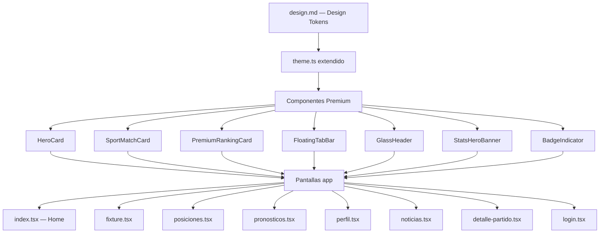
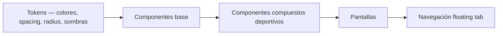
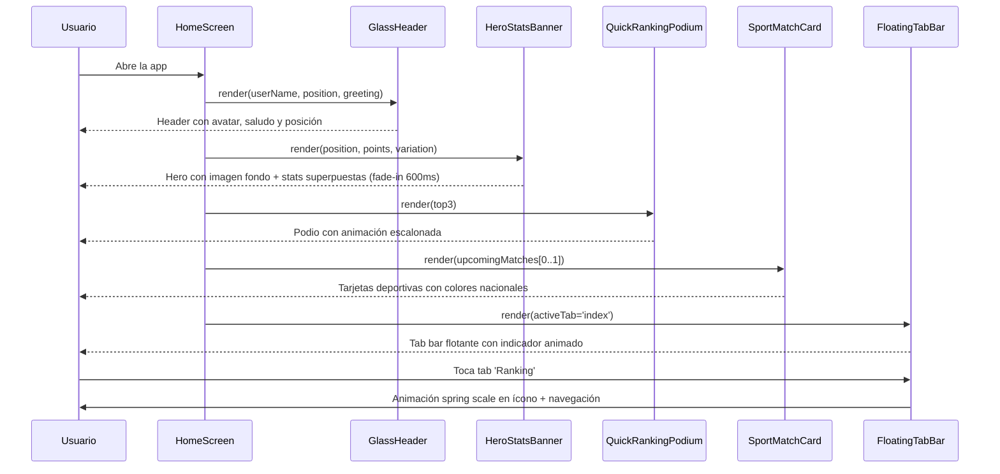
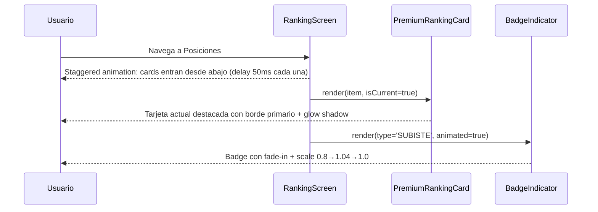

# Documento de Diseño: Rediseño Completo de UI — Prode del Mundial

## Overview

Rediseño total de la interfaz de la aplicación móvil de Prode del Mundial, transformándola de una UI funcional pero estática en una experiencia visual premium comparable a Sofascore, OneFootball o FIFA+. El diseño emplea glassmorphism suave, jerarquía visual fuerte, animaciones fluidas y un sistema de diseño deportivo moderno, manteniendo la base técnica de React Native + Expo Router y el sistema de temas existente.

El rediseño cubre todas las pantallas del área `(app)` y `(auth)`, extiende el sistema de tokens de diseño (`theme.ts`) y reemplaza los componentes UI principales sin modificar la lógica de negocio ni los stores de datos.

---

## Architecture

### Visión general del sistema de diseño



### Capas de diseño



---

## Components and Interfaces

### 1. Sistema de Tokens Extendido (`theme.ts`)

**Propósito**: Ampliar el sistema de tokens existente con valores específicos para el diseño premium deportivo.

**Nuevos tokens:**
```typescript
// Glassmorphism
glass: {
  light: 'rgba(255, 255, 255, 0.72)',
  dark: 'rgba(30, 30, 30, 0.72)',
  border: 'rgba(255, 255, 255, 0.18)',
  blur: 20, // BlurView intensity
}

// Gradientes Hero
gradients: {
  heroOverlay: ['rgba(0,0,0,0)', 'rgba(0,0,0,0.72)'],
  primaryFade: ['#CC2627', 'rgba(204,38,39,0)'],
  rankBadge: ['#CC2627', '#8B0000'],
  darkHero: ['rgba(13,13,13,0)', 'rgba(13,13,13,0.92)'],
}

// Colores de selecciones nacionales (sutiles)
national: {
  ARG: { primary: '#74ACDF', bg: 'rgba(116,172,223,0.12)' }, // celeste
  BRA: { primary: '#F4C430', bg: 'rgba(244,196,48,0.12)' },  // amarillo
  FRA: { primary: '#003189', bg: 'rgba(0,49,137,0.12)' },    // azul
  DEU: { primary: '#3B3B3B', bg: 'rgba(59,59,59,0.12)' },    // negro/gris
  ESP: { primary: '#C60B1E', bg: 'rgba(198,11,30,0.12)' },   // rojo
  ENG: { primary: '#CF142B', bg: 'rgba(207,20,43,0.12)' },   // rojo oscuro
  POR: { primary: '#006600', bg: 'rgba(0,102,0,0.12)' },     // verde
  DEFAULT: { primary: '#5C5C5C', bg: 'rgba(92,92,92,0.10)' },
}

// Radio extendido
radius: {
  ...existing,
  '2xl': 24,
  '3xl': 32,
}

// Sombras premium
shadows: {
  ...existing,
  glow: {  // sombra de color primario
    shadowColor: '#CC2627',
    shadowOffset: { width: 0, height: 4 },
    shadowOpacity: 0.28,
    shadowRadius: 12,
    elevation: 8,
  },
  float: {  // para tab bar flotante
    shadowColor: '#000',
    shadowOffset: { width: 0, height: -4 },
    shadowOpacity: 0.14,
    shadowRadius: 20,
    elevation: 12,
  },
}
```

---

### 2. `GlassHeader` — Header Premium

**Propósito**: Reemplazar el `AppHeader` actual con una barra de navegación superior que muestra avatar del usuario, saludo dinámico con posición en torneo, y acciones a la derecha.

**Interface:**
```typescript
interface GlassHeaderProps {
  userName: string
  userInitials: string
  position: number
  greeting: string           // "Buenos días", "Buenas tardes", "Buenas noches"
  onNotificationsPress: () => void
  onMenuPress: () => void
  hasUnreadNotifications?: boolean
}
```

**Anatomía visual:**
```
┌─────────────────────────────────────────────┐
│  [Avatar]  Hola Matías 👋              🔔 ☰  │
│  JP        Puesto #4 del torneo              │
└─────────────────────────────────────────────┘
```

**Responsabilidades:**
- Calcular saludo según hora del día (buenos días/tardes/noches)
- Mostrar avatar circular con iniciales y borde de color primario
- Badge rojo en ícono de notificaciones si `hasUnreadNotifications`
- Fondo con efecto glass (blur + semi-transparente) en scroll
- Altura total: 72px + safe area top

---

### 3. `HeroStatsBanner` — Hero principal

**Propósito**: Reemplazar el carrusel de imágenes y las 3 tarjetas pequeñas de estadísticas por un bloque hero unificado con imagen de fondo del Mundial, overlay oscuro y estadísticas superpuestas.

**Interface:**
```typescript
interface HeroStatsBannerProps {
  backgroundImageUrl?: string   // URL imagen fondo (estadio/Mundial)
  position: number              // #4
  points: number                // 2450
  variation: number             // +120
  variationDirection: 'up' | 'down' | 'neutral'
  remainingMatches: number      // 2
  tournamentName: string        // "Mundial 2026"
  onViewRankingPress: () => void
}
```

**Anatomía visual:**
```
┌─────────────────────────────────────────────────┐
│  [Imagen fútbol/estadio con overlay 70% oscuro]  │
│                                                   │
│   🏆  2450 PTS                 #4 DEL RANKING     │
│                                                   │
│   ↑ +120 esta fecha     Quedan 2 partidos        │
│                                                   │
│                  [ Ver ranking → ]                │
└─────────────────────────────────────────────────┘
```

**Responsabilidades:**
- Altura fija: 220px
- Gradiente de overlay: `rgba(0,0,0,0)` → `rgba(0,0,0,0.75)` (de arriba a abajo)
- Border-radius: 24px
- Indicador de variación: flecha ↑ (verde) o ↓ (rojo) con animación de entrada fade+slide
- Fallback de fondo: gradiente `#1a0a0a` → `#CC2627` si no hay imagen

---

### 4. `PremiumStatsCard` — Tarjeta única de estadísticas

**Propósito**: Sustituir las 3 tarjetas pequeñas por una tarjeta premium con glassmorphism.

**Interface:**
```typescript
interface PremiumStatsCardProps {
  position: number
  points: number
  variation: number
  variationDirection: 'up' | 'down'
  trend: 'rising' | 'stable' | 'falling'
}
```

**Anatomía visual:**
```
┌──────────────────────────────────────────┐
│  🏆 Mi Posición                           │
│                                           │
│      #4          ↑ +120 esta jornada      │
│   2450 pts                                │
└──────────────────────────────────────────┘
```

---

### 5. `SportMatchCard` — Tarjeta de partido deportiva

**Propósito**: Reemplazar el `MatchCard` existente con un diseño tipo Sofascore: escudos/banderas, colores nacionales sutiles, pronóstico integrado.

**Interface:**
```typescript
interface SportMatchCardProps {
  homeTeam: string
  awayTeam: string
  homeCode: string       // 'ARG', 'BRA', etc.
  awayCode: string
  homeFlagEmoji: string  // '🇦🇷'
  awayFlagEmoji: string  // '🇧🇷'
  date: string
  time: string
  group?: string
  phase: string
  userPrediction?: string  // '2 - 1'
  matchStatus: 'upcoming' | 'live' | 'finished'
  onPress?: () => void
}
```

**Anatomía visual:**
```
┌────────────────────────────────────────────────┐
│  🇦🇷 ARG          VS          BRA 🇧🇷            │
│  Argentina       20 Nov      Brasil             │
│  [fondo celeste] 18:00  [fondo amarillo]        │
│                                                 │
│  Grupo A   •   Mi pronóstico: 2 - 1             │
└────────────────────────────────────────────────┘
```

**Responsabilidades:**
- Aplicar color nacional sutil en el fondo de cada mitad de tarjeta
- Badge "EN VIVO" pulsante si `matchStatus === 'live'`
- Mostrar pronóstico del usuario si existe
- Press animation: scale 0.97 en 150ms

---

### 6. `QuickRankingPodium` — Top 3 competitivo

**Propósito**: Sección visual del podio (🥇🥈🥉) para la pantalla Home, transmitiendo competencia.

**Interface:**
```typescript
interface QuickRankingPodiumProps {
  top3: Array<{
    position: 1 | 2 | 3
    name: string
    points: number
    initials: string
    isCurrent: boolean
  }>
  onViewAllPress: () => void
}
```

**Anatomía visual:**
```
        🥇 Martín          
       2850 pts            
  🥈 Sofía    🥉 Lucas     
  2620 pts    2500 pts     
```

---

### 7. `BadgeIndicator` — Badges de estado

**Propósito**: Indicadores visuales de logros/eventos: SUBISTE, BAJASTE, NUEVO LÍDER, TOP 10, RACHA.

**Interface:**
```typescript
type BadgeType = 'SUBISTE' | 'BAJASTE' | 'NUEVO_LIDER' | 'TOP_10' | 'RACHA'

interface BadgeIndicatorProps {
  type: BadgeType
  animated?: boolean  // fade-in al montar
}

const BADGE_CONFIG: Record<BadgeType, { label: string; color: string; icon: string }> = {
  SUBISTE:      { label: '↑ SUBISTE',    color: '#4CAF50', icon: 'trending-up' },
  BAJASTE:      { label: '↓ BAJASTE',    color: '#F44336', icon: 'trending-down' },
  NUEVO_LIDER:  { label: '👑 NUEVO LÍDER', color: '#F4C430', icon: 'crown' },
  TOP_10:       { label: '🎯 TOP 10',    color: '#CC2627', icon: 'target' },
  RACHA:        { label: '🔥 RACHA',     color: '#FF6B35', icon: 'fire' },
}
```

---

### 8. `FloatingTabBar` — Navbar flotante

**Propósito**: Reemplazar el `BottomTabBar` actual con una barra flotante con fondo glass, sombra pronunciada y bordes redondeados, inspirada en Instagram/Sofascore.

**Interface:**
```typescript
interface FloatingTabBarProps {
  state: TabState
  navigation: TabNavigation
  descriptors: TabDescriptors
}

const TAB_CONFIG = [
  { name: 'index',       label: 'Inicio',      icon: 'home'        },
  { name: 'fixture',     label: 'Fixture',     icon: 'calendar'    },
  { name: 'posiciones',  label: 'Ranking',     icon: 'bar-chart-2' },
  { name: 'pronosticos', label: 'Pronósticos', icon: 'award'       },
  { name: 'perfil',      label: 'Perfil',      icon: 'user'        },
]
```

**Anatomía visual:**
```
    ┌──────────────────────────────────────────┐
    │  🏠    📅    [●]    🏆    👤             │
    │ Inicio Fixture Ranking Prono Perfil      │
    └──────────────────────────────────────────┘  ← floating, 20px desde bottom, margin h 16px
```

**Responsabilidades:**
- Fondo: glass (blur 20 + `rgba(255,255,255,0.85)` light / `rgba(20,20,20,0.90)` dark)
- Borde superior: `rgba(255,255,255,0.3)` light / `rgba(255,255,255,0.08)` dark
- Border radius: 28px (pill shape)
- Indicador activo: punto/píldora animada debajo del ícono, color primario
- Transición de tab: Animated.spring scale 1.0→1.12→1.0 en 200ms
- Height: 64px + safe area bottom

---

### 9. `PremiumRankingCard` — Fila de ranking mejorada

**Propósito**: Reemplazar `RankingCard` con diseño premium: avatar con iniciales, indicador de variación, destacado visual para el usuario actual.

**Interface:**
```typescript
interface PremiumRankingCardProps {
  item: PositionItem & {
    variation?: number
    variationDirection?: 'up' | 'down' | 'neutral'
    badge?: BadgeType
  }
}
```

**Anatomía visual:**
```
┌──────────────────────────────────────────────────┐
│  4   [JP]  Juan (Tú)           2450 pts  ↑+7    │  ← highlighted con borde primario
└──────────────────────────────────────────────────┘
┌──────────────────────────────────────────────────┐
│  5   [PP]  Pedro               2300 pts  +2     │
└──────────────────────────────────────────────────┘
```

---

## Data Models

### `TeamColorMap` — Mapa de colores nacionales

```typescript
interface NationalColor {
  primary: string    // color principal del equipo
  bg: string         // fondo sutil (opacity ~12%)
}

type TeamColorMap = Record<string, NationalColor>

const NATIONAL_COLORS: TeamColorMap = {
  ARG: { primary: '#74ACDF', bg: 'rgba(116,172,223,0.12)' },
  BRA: { primary: '#F4C430', bg: 'rgba(244,196,48,0.12)'  },
  FRA: { primary: '#003189', bg: 'rgba(0,49,137,0.12)'    },
  DEU: { primary: '#3B3B3B', bg: 'rgba(59,59,59,0.12)'    },
  ESP: { primary: '#C60B1E', bg: 'rgba(198,11,30,0.12)'   },
  ENG: { primary: '#CF142B', bg: 'rgba(207,20,43,0.12)'   },
  POR: { primary: '#006600', bg: 'rgba(0,102,0,0.12)'     },
  ITA: { primary: '#003399', bg: 'rgba(0,51,153,0.12)'    },
  NED: { primary: '#FF6600', bg: 'rgba(255,102,0,0.12)'   },
  URU: { primary: '#5AAEE2', bg: 'rgba(90,174,226,0.12)'  },
}
```

### `FlagEmojiMap` — Emojis de banderas

```typescript
const FLAG_EMOJIS: Record<string, string> = {
  ARG: '🇦🇷', BRA: '🇧🇷', FRA: '🇫🇷', DEU: '🇩🇪',
  ESP: '🇪🇸', ENG: '🏴󠁧󠁢󠁥󠁮󠁧󠁿', POR: '🇵🇹', ITA: '🇮🇹',
  NED: '🇳🇱', URU: '🇺🇾', USA: '🇺🇸', QAT: '🇶🇦',
  ECU: '🇪🇨', SEN: '🇸🇳', GAL: '🏴󠁧󠁢󠁷󠁬󠁳󠁿', DEFAULT: '🏳️',
}
```

### `AnimationConfig` — Configuración de animaciones

```typescript
interface AnimationConfig {
  duration: {
    fast: 150      // micro-interacciones (press, hover)
    normal: 250    // transiciones de estado
    slow: 350      // animaciones de entrada/salida
    hero: 600      // animaciones de hero/entrada de pantalla
  }
  easing: {
    spring: { damping: 15, stiffness: 150 }   // rebote suave
    smooth: 'ease-in-out'
    enter: 'ease-out'
  }
  scale: {
    press: 0.97     // escala al presionar
    active: 1.08    // escala de tab activa
    badge: 1.04     // escala de badge al aparecer
  }
}
```

---

## Diagramas de Secuencia

### Flujo de Home Screen



### Flujo de Ranking Screen



---

## Diseño Detallado por Pantalla

### Home Screen (`app/(app)/index.tsx`)

**Layout vertical:**
1. `GlassHeader` (72px + safe area)
2. `ScrollView` sin padding horizontal en el contenedor raíz
3. `HeroStatsBanner` (220px, margin horizontal 16px, border-radius 24px)
4. Sección "Próximos Partidos" — título + 2× `SportMatchCard`
5. `QuickRankingPodium` — podio Top 3
6. Sección "Accesos Rápidos" — grid 2×2 con iconos grandes
7. Padding bottom 100px (para flotar sobre tab bar)

**Espaciado entre secciones:** 24px

---

### Fixture Screen (`app/(app)/fixture.tsx`)

**Layout:**
1. `GlassHeader` (sin saludo dinámico en esta pantalla)
2. Título "Fixture" — 28px, fontWeight 800
3. Scroll horizontal de tabs de fase — pill shape, borde redondeado 20px
4. Lista de `SportMatchCard`s agrupadas por fecha
5. Separador de fecha: línea con texto de fecha centrado

**Tab de fase activa:** fondo `#CC2627`, texto blanco, sombra roja sutil

---

### Posiciones Screen (`app/(app)/posiciones.tsx`)

**Layout:**
1. `GlassHeader`
2. Título "Posiciones"
3. Tabs "General" / "Semanal"
4. Cabecera de tabla compacta: # / Usuario / Pts / PJ / Dif
5. Lista de `PremiumRankingCard`s con stagger animation
6. Row del usuario actual siempre visible (sticky si fuera de vista)

**Destacado de usuario actual:**
- Border: 2px solid `#CC2627`
- Background: `rgba(204,38,39,0.06)` light / `rgba(204,38,39,0.10)` dark
- Shadow glow rojo suave

---

### Pronósticos Screen (`app/(app)/pronosticos.tsx`)

**Layout:**
1. `GlassHeader`
2. Título + badge contador de pendientes
3. Tabs: "Pendientes" / "Guardados" / "Todos"
4. Lista de `PredictionCard` rediseñada:
   - Muestra equipos con emojis de bandera
   - Status badge: "Pendiente" (naranja), "Guardado" (verde), "Finalizado" (gris)
   - Score con tipografía grande

---

### Perfil Screen (`app/(app)/perfil.tsx`)

**Layout:**
1. Fondo hero degradado (primario a background) — 200px
2. Avatar circular grande (96px) centrado, con borde blanco 3px y sombra
3. Nombre y número de empleado
4. `PremiumStatsCard` rediseñada: 3 métricas en fila
5. `BadgeIndicator` de logro actual (TOP 10, RACHA, etc.)
6. Menú de opciones con íconos Feather, separadores suaves
7. Botón cerrar sesión con ícono de logout

---

### Login Screen (`app/(auth)/login.tsx`)

**Layout:**
1. Fondo oscuro con imagen sutil de fútbol/mundial como textura (o gradiente oscuro)
2. Logo centrado (120px)
3. Título "Bienvenido al Prode" en tipografía grande
4. Card de formulario con glassmorphism suave
5. Inputs con borde redondeado 16px, borde sutil
6. Botón primario con fondo `#CC2627`, borde-radius 16px, sombra roja
7. Animación de entrada: logo desde arriba (slide-down), card desde abajo (slide-up)

---

### Detalle de Partido (`app/(app)/details/detalle-partido.tsx`)

**Layout:**
1. Header de partido: hero card con ambos equipos, emojis de bandera, VS central
2. Colores nacionales de fondo en cada mitad
3. Tabs "Pronóstico" / "Estadísticas" / "H2H" — pill shape
4. Sección pronóstico:
   - "¿Quién ganará?": 3 botones grandes con nombre y bandera
   - "Resultado exacto": chips de resultado en grilla
   - "Detalles": chips toggle (Clasificado / Alargue / Penales)
5. CTA botón guardar — ancho completo, sombra roja

---

## Algoritmos Clave con Especificaciones Formales

### Algoritmo de Saludo Dinámico

```typescript
/**
 * getGreeting — Calcula saludo según hora local
 * 
 * Preconditions:
 *   - hour ∈ [0, 23]
 * 
 * Postconditions:
 *   - retorna string no vacío
 *   - retorna "Buenos días"   si 6  ≤ hour < 12
 *   - retorna "Buenas tardes" si 12 ≤ hour < 20
 *   - retorna "Buenas noches" si hour ≥ 20 OR hour < 6
 */
function getGreeting(hour: number): string {
  if (hour >= 6 && hour < 12)  return 'Buenos días'
  if (hour >= 12 && hour < 20) return 'Buenas tardes'
  return 'Buenas noches'
}
```

### Algoritmo de Resolución de Color Nacional

```typescript
/**
 * getNationalColor — Resuelve color del equipo por código ISO
 * 
 * Preconditions:
 *   - teamCode es string (puede ser desconocido)
 * 
 * Postconditions:
 *   - Siempre retorna NationalColor válido
 *   - Si teamCode ∈ NATIONAL_COLORS → retorna colores específicos
 *   - Si teamCode ∉ NATIONAL_COLORS → retorna DEFAULT
 *   - No lanza excepciones
 */
function getNationalColor(teamCode: string): NationalColor {
  return NATIONAL_COLORS[teamCode.toUpperCase()] ?? NATIONAL_COLORS.DEFAULT
}
```

### Algoritmo de Animación Escalonada (Stagger)

```typescript
/**
 * useStaggeredAnimation — Hook para animación escalonada de listas
 * 
 * Preconditions:
 *   - count ≥ 0
 *   - staggerDelay > 0
 * 
 * Postconditions:
 *   - retorna array de count Animated.Value
 *   - cada valor va de 0 → 1 con delay de (index × staggerDelay) ms
 *   - animación se inicia al montar el componente (useEffect)
 *   - se limpia al desmontar
 * 
 * Loop Invariant:
 *   - Para todo índice i ∈ [0, count-1]:
 *     animations[i].delay = i × staggerDelay
 */
function useStaggeredAnimation(count: number, staggerDelay: number = 50): Animated.Value[] {
  const animations = useMemo(
    () => Array.from({ length: count }, () => new Animated.Value(0)),
    [count]
  )
  
  useEffect(() => {
    const staggered = Animated.stagger(
      staggerDelay,
      animations.map(anim =>
        Animated.timing(anim, {
          toValue: 1,
          duration: 350,
          useNativeDriver: true,
        })
      )
    )
    staggered.start()
    return () => staggered.stop()
  }, [animations, staggerDelay])
  
  return animations
}
```

### Algoritmo de Press Animation

```typescript
/**
 * usePressAnimation — Hook para micro-animación de press
 * 
 * Preconditions:
 *   - scaleTarget ∈ (0, 1)  (típicamente 0.97)
 * 
 * Postconditions:
 *   - onPressIn: scale 1.0 → scaleTarget en 150ms (spring)
 *   - onPressOut: scale scaleTarget → 1.0 en 150ms (spring)
 *   - retorna { animatedStyle, onPressIn, onPressOut }
 */
function usePressAnimation(scaleTarget: number = 0.97): PressAnimationResult {
  const scaleAnim = useRef(new Animated.Value(1)).current
  
  const onPressIn = useCallback(() => {
    Animated.spring(scaleAnim, {
      toValue: scaleTarget,
      useNativeDriver: true,
      damping: 15,
      stiffness: 300,
    }).start()
  }, [scaleAnim, scaleTarget])
  
  const onPressOut = useCallback(() => {
    Animated.spring(scaleAnim, {
      toValue: 1,
      useNativeDriver: true,
      damping: 15,
      stiffness: 300,
    }).start()
  }, [scaleAnim])
  
  return {
    animatedStyle: { transform: [{ scale: scaleAnim }] },
    onPressIn,
    onPressOut,
  }
}
```

---

## Error Handling

### Escenario 1: Imagen de fondo Hero no disponible

**Condición**: `backgroundImageUrl` es `undefined`, vacío o la URL falla al cargar.  
**Respuesta**: Activar fallback automático con gradiente `linear-gradient(135deg, #1a0000, #CC2627)` usando `expo-linear-gradient`.  
**Recuperación**: No requiere acción del usuario.

### Escenario 2: Emoji de bandera no disponible en el sistema

**Condición**: El emoji Unicode de bandera no se renderiza correctamente en Android API < 29.  
**Respuesta**: Mostrar código de 3 letras en bloque coloreado (`flagBlock` con fondo de color nacional).  
**Recuperación**: Automática, sin degradación visible.

### Escenario 3: Fuente Poppins no cargada

**Condición**: Fallo de red al cargar `@expo-google-fonts/poppins`.  
**Respuesta**: El `ThemeProvider` existente ya maneja este caso (bloquea render hasta que `fontsLoaded`). Todos los nuevos componentes heredan este comportamiento.  
**Recuperación**: Automática al retry de conexión.

### Escenario 4: `expo-blur` no disponible en la plataforma

**Condición**: `BlurView` no soportado en versiones de Android < API 31 sin aceleración de hardware.  
**Respuesta**: Fallback a background sólido semi-transparente: `rgba(255,255,255,0.92)` en light / `rgba(20,20,20,0.94)` en dark.  
**Recuperación**: Automática, degradación visual mínima.

---

## Testing Strategy

### Testing unitario

- Test de `getGreeting()` con valores límite (5, 6, 11, 12, 19, 20, 23, 0)
- Test de `getNationalColor()` con códigos conocidos, desconocidos y case variations
- Test de `BadgeIndicator` con cada tipo de badge
- Test de `GlassHeader` con y sin notificaciones no leídas

### Testing de propiedades

**Librería**: `fast-check` (ya disponible en el ecosistema Jest de Expo)

**Propiedades clave:**
- `getGreeting(h)` siempre retorna string no vacío para todo `h ∈ [0,23]`
- `getNationalColor(code)` nunca retorna `undefined` para ningún string de entrada
- `useStaggeredAnimation(n)` siempre retorna array de exactamente `n` elementos
- Animación de press: `scaleTarget` siempre queda en `1.0` después de `onPressOut`

### Testing de integración

- Renderizado de `HomeScreen` completo con datos mock
- Navegación entre tabs con `FloatingTabBar`
- Switch de tema claro/oscuro aplica tokens correctos a todos los nuevos componentes

### Testing de accesibilidad

- Todos los íconos interactivos tienen `accessibilityLabel`
- Contraste de colores cumple WCAG AA (4.5:1 mínimo) en textos principales
- Badge de notificaciones tiene `accessibilityRole="alert"`

---

## Consideraciones de Rendimiento

1. **`useNativeDriver: true`** en todas las animaciones de transform/opacity para ejecutarse en el hilo de UI nativo (evitar jank)
2. **`React.memo`** en `SportMatchCard` y `PremiumRankingCard` para evitar re-renders en listas largas
3. **`FlatList` con `getItemLayout`** en pantalla de Posiciones para scroll virtualizad eficiente
4. **`BlurView`** sólo en header y tab bar (2 instancias), no en tarjetas de lista
5. **Imágenes** del Hero cargadas con `Image` + `cachePolicy: 'memory-disk'` via `expo-image` si disponible, fallback a `Image` de React Native
6. **Gradientes** con `expo-linear-gradient` (ya disponible en Expo) — sin dependencia nueva
7. **Stagger animations** detenidas y limpiadas en `useEffect` cleanup para evitar memory leaks

---

## Consideraciones de Seguridad

1. Las URLs de imagen del Hero se pasan como prop y deben provenir de fuentes confiables (ya gestionadas por `sliderStore`)
2. El nombre de usuario se obtiene de `authStore` — datos ya sanitizados en el proceso de autenticación
3. No se exponen datos sensibles del usuario en el Header (sólo nombre e iniciales)

---

## Dependencias

### Existentes (sin cambios)
- `expo-router` — navegación
- `react-native-safe-area-context` — safe areas
- `@expo/vector-icons` (Feather, MaterialCommunityIcons) — iconos
- `@expo-google-fonts/poppins` — tipografía
- `react-native` Animated API — animaciones
- `zustand` — state management (authStore, themeStore)

### A agregar
- `expo-linear-gradient` — gradientes para Hero y fondos premium (paquete oficial Expo, sin conflictos)
- `expo-blur` — efecto glassmorphism en Header y TabBar (paquete oficial Expo)

### Evaluadas y descartadas
- `react-native-reanimated`: Proporciona animaciones más potentes pero requiere configuración adicional de Babel y presenta incompatibilidades en algunos entornos Expo Go. Las animaciones requeridas son alcanzables con la API `Animated` nativa.
- `react-native-skia`: Excesiva para los efectos visuales necesarios.

---

## Correctness Properties

### Tokens de diseño
- Para todo componente `C` en la app: `C` usa exclusivamente tokens de `theme.ts` — nunca colores hardcodeados (excepto `NATIONAL_COLORS` y `FLAG_EMOJIS` que son datos de dominio)
- Para todo par (lightToken, darkToken) en el tema: `lightToken` tiene contraste ≥ 4.5:1 con su background correspondiente

### Modo oscuro
- Para todo componente rediseñado `C`: `C` responde correctamente a `theme.isDark` sin necesidad de lógica adicional — todos los colores provienen del objeto `theme.colors`
- No existe ningún color hardcodeado en los nuevos componentes que no tenga equivalente para ambos modos

### Animaciones
- Para toda animación `A` con `useNativeDriver: true`: `A` no modifica propiedades que no sean `transform` u `opacity`
- Para todo hook `usePressAnimation`: el valor de `scale` después de `onPressOut` es siempre exactamente `1.0`
- Para `useStaggeredAnimation(n, d)`: `animations.length === n` y `animations[i].delay === i * d` para todo `i ∈ [0, n-1]`

### Colores nacionales
- `getNationalColor(code)` es una función total: definida para todo string posible (incluido vacío)
- La opacidad de `bg` en `NationalColor` es siempre ≤ 0.15 para no comprometer la legibilidad del texto superpuesto
